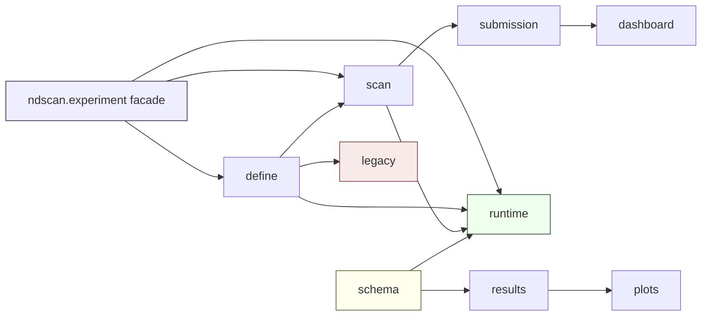
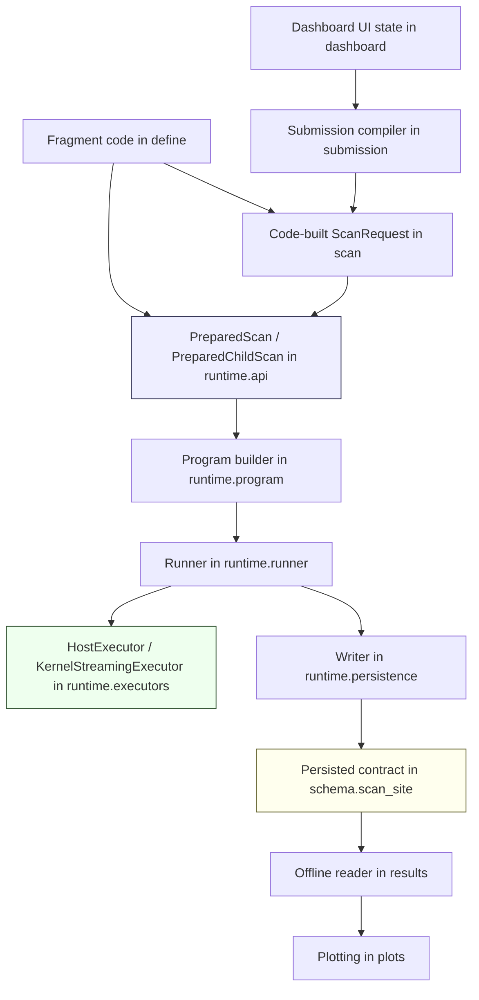

# Module Namespace Tidy-Up Proposal

This note proposes an updated module layout for the current prepared-scan direction.

It replaces the older tidy-up sketch with a structure that better matches what the
codebase has become after the recent runtime work:

- one prepared scan runtime shared by host and kernel execution
- one scan-semantics layer used by both fragment rebindings and ad hoc request mappings
- one submission/compiler boundary
- one persisted scan-site schema contract
- one clearly isolated legacy path


## Short Thesis

The code is now easier to think about if it is split into:

- `define`
- `scan`
- `submission`
- `runtime`
- `schema`
- `legacy`
- `dashboard`
- `results`
- `plots`

with `ndscan.experiment` kept as a public facade.

The two most important refinements compared to the earlier tidy-up note are:

1. `request/` should really be `scan/`
2. persisted dataset schema should not live inside `runtime/`


## Why `scan/` Rather Than `request/`

After the recent runtime work, `request/` looks slightly too narrow as a name.

The reason is `ParameterMapping`.

Today there is only one real mapping execution path:

- fragment-side `rebind_param(...)` creates `ParameterMapping`
- ad hoc request-level mappings also use `ParameterMapping`
- submission text/schema compilation also lowers to `ParameterMapping`
- runtime execution merges them all and applies them through the same per-point logic

So mappings are not just "part of request submission". They are part of scan
semantics.

The same is true, more mildly, for:

- `ScanVariable`
- fixed pseudoparams
- point policies
- BO ask/tell point-selection logic

These are all part of "what scan is being described", not part of "how the runtime is
executing it right now".

So the cleaner conceptual package name is:

- `scan/`

rather than:

- `request/`


## Why `schema/` Needs To Exist

There is a second boundary that becomes clearer once the new runtime is taken
seriously: the persisted scan-site schema is not the same thing as runtime writing.

Those are three separate concerns:

1. the persisted schema contract
2. the runtime writer implementation
3. the offline reader/plotting interpretation

For example, the current [`scan_site.py`](/home/lab/artiq-files/install/ndscan/ndscan/experiment/scan_site.py)
mixes:

- `ScanSite` as a structural schema object
- dataset key conventions
- `ScanSiteDatasetWriter` as runtime write behavior

That is workable, but it couples:

- runtime execution
- persisted schema definition
- results reading

more tightly than necessary.

The cleaner split is:

- `schema/scan_site.py`: persisted contract
- `runtime/persistence.py`: writer and preview coordination
- `results/scan_site_reader.py`: offline reader


## Recommended Top-Level Structure

If the project were being laid out now, a good target tree would be:

```text
ndscan/
    __init__.py

    experiment/
        __init__.py          # public facade for experiment authoring

    define/
        __init__.py
        fragment.py
        parameters.py
        result_channels.py
        annotations.py
        default_analysis.py

    scan/
        __init__.py
        request.py
        policy.py
        mappings.py
        variables.py
        optimisation.py

    submission/
        __init__.py
        scan_spec.py
        compile.py
        transport.py
        expression.py
        overrides.py

    runtime/
        __init__.py
        api.py
        context.py
        program.py
        runner.py
        executors.py
        analysis.py
        persistence.py
        adapters.py

    schema/
        __init__.py
        scan_site.py

    legacy/
        __init__.py
        entry_point.py
        scan_generator.py
        scan_runner.py
        subscan.py

    dashboard/
        __init__.py
        argument_editor.py
        param_tree_dialog.py
        override_entry.py
        scan_options.py
        scan_submission_options.py
        submission/
            __init__.py
            common.py
            prepared.py
            legacy.py

    results/
        __init__.py
        arguments.py
        scan_site_reader.py
        pyplot.py
        tools.py

    plots/
        __init__.py
        ...

    common/
        __init__.py
        ...
```


## Responsibilities By Package

### `define/`

This is the experiment-building ontology:

- fragments
- parameters
- result-channel declarations
- fragment-defined analyses
- annotations

This is what experiment authors conceptually program against.

It should be the most stable area of the tree.

### `scan/`

This is the scan-semantics layer.

It should contain:

- `ScanRequest`
- execution policy
- preview policy
- `ScanVariable`
- fixed pseudoparams
- `ParameterMapping`
- point policies
- BO point-selection backends

This layer answers:

- what scan is being described?
- what logical quantities vary?
- how are concrete parameter values derived?
- how are batches chosen?

It should not care whether execution later happens:

- on the host
- through a resident kernel loop

### `submission/`

This is the bridge from external/declarative representations to scan semantics.

It should contain:

- typed spec dataclasses
- transport dict round-tripping
- schema validation
- expression compilation for text mappings
- compilation into `ScanRequest` plus overrides

This is where the current [`scan_submission_schema.py`](/home/lab/artiq-files/install/ndscan/ndscan/experiment/scan_submission_schema.py)
really belongs conceptually.

The important rule is:

- `submission/` may depend on `define/` and `scan/`
- `runtime/` should not depend on dashboard UI

### `runtime/`

This is the prepared-scan execution core.

It should contain:

- `PreparedScan`
- `PreparedChildScan`
- root/nested execution context
- request binding and runnable program creation
- host/kernel executors
- runtime analysis adapters
- runtime persistence/writer coordination
- thin `EnvExperiment` adapters

This namespace should represent:

- one runtime concept
- multiple executors

not separate host and kernel runtimes.

### `schema/`

This is the persisted contract for scan-site data.

It should contain:

- `ScanSite`
- schema revision constants
- stable key/group naming conventions
- any small schema-only encode/decode helpers

It should **not** contain:

- `HasEnvironment`
- dataset manager calls
- preview file logic
- runtime batch orchestration

Both `runtime/` and `results/` should depend on this package, not on each other.

### `legacy/`

This is the old execution model, clearly named as such.

It should contain:

- `entry_point.py`
- `scan_generator.py`
- `scan_runner.py`
- `subscan.py`

This keeps legacy code available without letting it continue to shape the new runtime
layout.

### `dashboard/`

This is UI code only.

The important split inside it is:

- widgets/editor state
- submission-state translation

The dashboard should produce submission objects and transport payloads. It should not
invent its own runtime semantics.

### `results/` and `plots/`

These remain separate.

Offline reading and plotting should stay decoupled from the runtime as much as
possible.


## Recommended Dependency Rules

The dependency rules matter more than the names.

The intended dependency shape is:



More explicitly:

- `define/` depends only on small shared utilities
- `scan/` may depend on `define/`
- `submission/` may depend on `define/` and `scan/`
- `runtime/` may depend on `define/`, `scan/`, and `schema/`
- `dashboard/` may depend on `submission/`, not on runtime internals
- `results/` may depend on `schema/`, not on runtime controller objects
- `legacy/` may depend on `define/`, but should stay isolated from the new runtime

The most important prohibitions are:

- `runtime/` should not depend on dashboard code
- `results/` should not depend on runtime execution code
- `schema/` should not depend on runtime code


## Sensible Cross-Module Interfaces

The interfaces between these packages should be small and explicit.

### `define -> scan`

Shared authoring/runtime reference types:

- `ParamHandle`
- `ResultChannel`
- fragment-defined analysis declarations

`scan/` uses these to describe what is being scanned or derived.

### `submission -> scan`

This should compile down to a small boundary:

- `ScanRequest`
- override store map

That is the only thing the runtime should need from submission.

### `scan -> runtime`

The runtime should consume:

- `ScanRequest`
- `ExecutionPolicy`
- point-policy interfaces
- `ParameterMapping`

It should not need to know whether the request came from:

- code
- dashboard
- typed spec
- transport dict

### `schema -> runtime` and `schema -> results`

The shared persisted-data boundary should be:

- `ScanSite`
- schema revision constants
- stable dataset key semantics

`runtime/` writes it. `results/` reads it.

### `runtime` internal boundaries

The runtime itself should be split around a few core objects:

- public prepared API
- request binding/program creation
- execution control
- executor backends
- persistence

That lets most modules depend on interfaces rather than on one giant file.


## Proposed Runtime Split

The biggest immediate simplification is to split the current
[the old runtime monolith](/home/lab/artiq-files/install/ndscan/ndscan/runtime/)
by responsibility.

A good split would be:

```text
runtime/
    api.py
    context.py
    program.py
    runner.py
    executors.py
    analysis.py
    persistence.py
    adapters.py
```

### `runtime/api.py`

Public prepared-scan surface:

- `ScanOutputs`
- `ScanInspection`
- `PreparedScan`
- `PreparedChildScan`
- `prepare_scan(...)`
- `prepare_child_scan(...)`
- `setattr_prepared_child_scan(...)`

This is the user-facing runtime API.

### `runtime/context.py`

Root-run and nested-scan execution context:

- `ActiveScanContext`
- run context
- preview policy
- preview coordinator
- contextvar helpers
- child-site derivation helpers

### `runtime/program.py`

Binding scan semantics to a concrete fragment:

- bound axis/parameter/result-channel dataclasses
- resolved execution-point lowering
- `ScanProgram`
- `ScanProgramBuilder`

This is where `ScanRequest` becomes runnable program state.

### `runtime/runner.py`

Runtime orchestration:

- `ScanProgramRunner`
- batch publication flow
- pause/restart/completion control

This is where the runtime lifecycle belongs.

### `runtime/executors.py`

Execution backends only:

- `HostExecutor`
- `KernelStreamingExecutor`
- resident kernel point runner
- point-invocation runner
- point result collection

This is where "how points run" belongs.

### `runtime/analysis.py`

Runtime-side analysis glue:

- host analysis adapter
- online/final analysis orchestration
- analysis metadata extraction

### `runtime/persistence.py`

Runtime write behavior:

- `ScanSiteDatasetWriter`
- preview snapshot writing
- writer transport adapter
- dataset-prefix helpers

This module should depend on `schema/scan_site.py`, not define the persisted schema
contract itself.

### `runtime/adapters.py`

Thin ARTIQ convenience wrappers:

- `PreparedScanExperiment`
- `PreparedDashboardScanExperiment`
- `make_fragment_prepared_scan_exp(...)`
- `make_fragment_prepared_dashboard_scan_exp(...)`


## Proposed `scan/` Split

The current request-side concepts should be grouped more clearly than they are now.

```text
scan/
    request.py
    policy.py
    mappings.py
    variables.py
    optimisation.py
```

### `scan/request.py`

- `ScanRequest`
- execution policy
- preview policy

### `scan/variables.py`

- `ScanVariable`
- `FixedPseudoparam`

### `scan/mappings.py`

- `ParameterMapping`
- shared mapping helpers

This is where both:

- fragment-side `rebind_param(...)`
- request-side ad hoc mappings

meet semantically.

### `scan/policy.py`

- `BasePoint`
- `BatchFeedback`
- point-policy interfaces and concrete policies

### `scan/optimisation.py`

- BO ask/tell backends
- acquisition/fitting helpers

This belongs here because BO is fundamentally point-selection logic, not an executor
feature.


## Proposed `submission/` Split

The current `scan_submission_schema.py` is doing more than one job.

A cleaner split would be:

```text
submission/
    scan_spec.py
    compile.py
    transport.py
    expression.py
    overrides.py
```

### `submission/scan_spec.py`

- typed spec dataclasses
- validation rules

### `submission/compile.py`

- spec/schema -> `ScanRequest`
- spec/schema -> override store map

### `submission/transport.py`

- dict payload round-tripping used by the dashboard argument channel

### `submission/expression.py`

- safe expression parsing / lowering for text mappings

### `submission/overrides.py`

- override map utilities / merge helpers


## Proposed `schema/` Split

The persisted scan-site contract deserves its own small home:

```text
schema/
    scan_site.py
```

That file should contain only schema concepts, for example:

- `ScanSite`
- schema revision constants
- stable field/key names
- maybe small schema-only helpers

It should not contain:

- ARTIQ `HasEnvironment`
- dataset sinks
- dataset manager writes
- preview snapshot logic

That runtime code belongs in `runtime/persistence.py`.


## How The Modules Come Together

The end-to-end picture should be:



In words:

- authoring code lives in `define/`
- scan semantics live in `scan/`
- dashboard transport becomes scan semantics in `submission/`
- prepared runtime entrypoints live in `runtime/api.py`
- execution backends live in `runtime/executors.py`
- persistence writes the schema defined in `schema/`
- results and plots read that persisted schema without runtime dependency


## Current Files Mapped To Proposed Homes

Current -> proposed home:

### Definition / authoring

- `experiment/fragment.py` -> `define/fragment.py`
- `experiment/parameters.py` -> `define/parameters.py`
- `experiment/result_channels.py` -> split:
  - channel definitions -> `define/result_channels.py`
  - sink/runtime-ish pieces -> likely `runtime/persistence.py` or a small sibling module
- `experiment/annotations.py` -> `define/annotations.py`
- `experiment/default_analysis.py` -> `define/default_analysis.py`

### Scan semantics

- pieces of `runtime/`:
  - `ScanRequest`
  - `ExecutionPolicy`
  - `PreviewPolicy`
  - `ScanVariable`
  - `ParameterMapping`
  -> `scan/*`
- `experiment/point_policy.py` -> `scan/policy.py`
- `experiment/optimisation.py` -> `scan/optimisation.py`
- `experiment/scan_mapping.py` -> `scan/mappings.py`

### Submission / compilation

- `experiment/scan_submission_schema.py` -> `submission/scan_spec.py` + `submission/compile.py` + `submission/transport.py`
- `experiment/expression.py` -> `submission/expression.py`
- override helpers from the old runtime monolith -> `submission/overrides.py`

### Prepared runtime

- `runtime/` -> split across `runtime/*`
- `experiment/_host_analysis.py` -> `runtime/analysis.py`

### Persisted schema

- `experiment/scan_site.py` -> split:
  - schema contract -> `schema/scan_site.py`
  - writer implementation -> `runtime/persistence.py`

### Legacy

- `experiment/entry_point.py` -> `legacy/entry_point.py`
- `experiment/scan_generator.py` -> `legacy/scan_generator.py`
- `experiment/scan_runner.py` -> `legacy/scan_runner.py`
- `experiment/subscan.py` -> `legacy/subscan.py`

### Dashboard

- `dashboard/submission/scan.py` -> `dashboard/submission/scan.py`
- `dashboard/submission/legacy.py` stays `dashboard/submission/legacy.py`


## What To Do With `ndscan.experiment`

Do not delete it. Turn it into a facade.

The user-facing imports can still be:

```python
from ndscan.experiment import *
```

but internally `ndscan.experiment` should mostly re-export from:

- `ndscan.define`
- `ndscan.scan`
- `ndscan.runtime.api`
- selected submission helpers where appropriate

This gives:

- stable public imports
- a much clearer internal tree


## What To Do With `utils`

`utils` should not become one of the major conceptual homes.

That is where structure goes to die.

Keep only genuinely generic helpers in `common/` or a tiny `utils.py`.

If a helper is about:

- scan semantics
- submission compilation
- runtime execution
- persisted schema
- dashboard state

then it should live in that package, not in a general catch-all.


## Recommended Incremental Migration

This is the order I would use.

### 1. Split the old runtime monolith into `runtime/` modules

Do this first while keeping `ndscan.experiment` re-exports stable.

This gives the biggest readability win with the least semantic churn.

### 2. Extract scan semantics into `scan/`

Move:

- `ScanRequest`
- execution policy
- preview policy
- `ScanVariable`
- `ParameterMapping`
- point policies

out of the old runtime monolith.

### 3. Split `scan_site.py`

Move:

- schema contract into `schema/scan_site.py`
- writer implementation into `runtime/persistence.py`

This is the clearest way to separate runtime writing from persisted contract.

### 4. Split `scan_submission_schema.py`

Turn it into:

- typed spec definitions
- compiler
- transport
- override helpers

rather than one mixed module.

### 5. Move legacy runtime into `legacy/`

This makes the codebase easier to navigate immediately.

### 6. Rename dashboard scan-submission to dashboard scan submission

This finishes removing old conceptual naming from the new path where practical.


## Explicit Recommendation

Compared to the earlier draft, the structure should now be:

- `define`
- `scan`
- `submission`
- `runtime`
- `schema`
- `legacy`
- `dashboard`
- `results`
- `plots`

with `ndscan.experiment` kept as a facade.

That is better than:

- keeping almost everything in `experiment/`
- splitting by `host` versus `kernel`
- making `utils` a major namespace
- keeping persisted scan-site schema hidden inside the runtime writer

because it mirrors the actual conceptual boundaries of the system we now have.


## Short Version

If only one sentence is remembered, it should be:

> Put scan semantics in `scan`, put transport/spec compilation in `submission`, put
> prepared execution in `runtime`, put persisted scan-site schema in `schema`,
> isolate the old path in `legacy`, and keep `ndscan.experiment` as the public
> facade.
