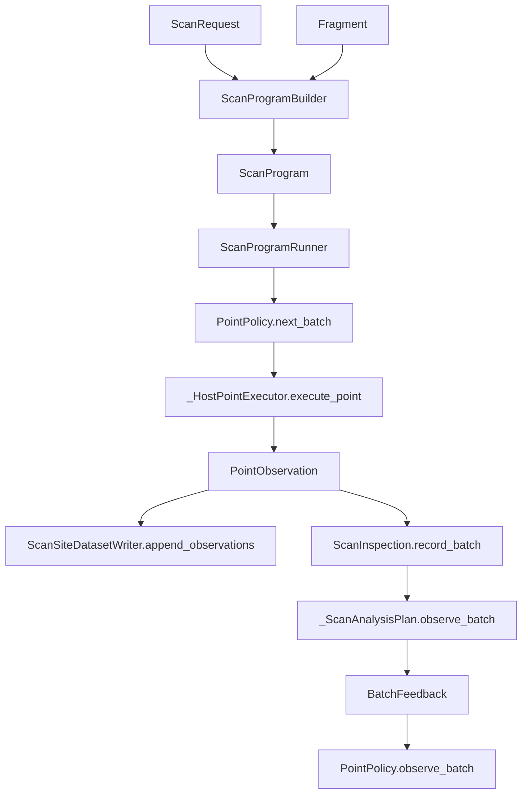

# Prepared Runtime: Current Design

This document describes the current implemented state of the new prepared scan
runtime in `ndscan.experiment.host_runtime`.

It is not a design wish-list. It is intended to answer:

- what the new runtime objects are,
- how a scan actually runs today,
- what gets written to the scan-site datasets,
- how nested scans, parameter mappings, batching, and online analysis currently fit
  together,
- what is still intentionally missing.

## Scope

This document only covers the new prepared runtime:

- [`ndscan/runtime/`](/home/lab/artiq-files/install/ndscan/ndscan/runtime/)
- [`ndscan/experiment/point_policy.py`](/home/lab/artiq-files/install/ndscan/ndscan/experiment/point_policy.py)
- [`ndscan/experiment/scan_site.py`](/home/lab/artiq-files/install/ndscan/ndscan/experiment/scan_site.py)
- [`ndscan/experiment/scan_mapping.py`](/home/lab/artiq-files/install/ndscan/ndscan/experiment/scan_mapping.py)

It does not describe the legacy `entry_point.py` / `scan_runner.py` / `subscan.py`
path except where a contrast is useful.

## Main Runtime Objects

### `ScanRequest`

User-facing description of one scan.

It currently contains:

- `axes`: a tuple of real `ParamHandle`s and/or logical `ScanVariable`s
- `point_policy`: the point policy
- `site`: the scan-site placement
- `metadata`: extra user metadata
- `execution_policy`: runtime scheduling knobs
- `parameter_mappings`: request-local parameter mappings

`ScanRequest` answers the question: "what scan do we want to run?"

### `ExecutionPolicy`

Runtime scheduling policy.

Today it is intentionally small:

- `max_points_per_batch`
- `preview_policy`

This answers: "how should the prepared runtime schedule the work?"

`preview_policy` is root-run scoped. Nested scans inherit the active root preview
coordinator rather than configuring their own snapshot cadence.

If `PreviewPolicy.path` is omitted, the runtime uses the same RID/class-name naming
scheme as ARTIQ's final HDF5 file and inserts `.preview` before the `.h5` suffix.

### `PointPolicy`

Point policy for choosing what to run next.

The key interface is:

- `next_batch(max_points)`
- `observe_batch(feedback)`
- `is_finished()`
- `preferred_batch_size(default)`

Current point-policy families include:

- static scans:
  - `SinglePointPolicy`
  - `CartesianPointPolicy`
  - `ZipPointPolicy`
  - `ExplicitPointPolicy`
- compositional scans:
  - `ConcatPointPolicy`
  - `ProductPointPolicy`
- adaptive / refinement / control:
  - `RecursiveMidpointPointPolicy1D`
  - `UntilConditionPointPolicy`
  - `RepeatPointPolicy`
  - `GradientDescentPointPolicy`

### `ScanVariable`

Logical runtime-only scan quantity.

This is used when a scan should be expressed in a convenient basis that is not itself
an actual fragment parameter.

Persisted schema role:

- metadata: `scan.pseudoparams`
- point data: `points.pseudoparam_*`

### `ParameterMapping`

Per-point mapping from logical inputs to concrete fragment parameters.

Mappings can depend on:

- real `ParamHandle`s
- runtime `ScanVariable`s

Mappings can target only real `ParamHandle`s.

There are two current declaration routes:

- ad hoc: attach mappings directly to a `ScanRequest`
- reusable: declare mappings on a fragment with `add_parameter_mapping(...)` or
  `rebind_param(...)`

### `PreparedScan`

Top-level entry point for executing one prepared-runtime scan.

The session owns:

- program building
- point execution lifecycle
- dataset writer setup
- retry / restart loop

### `ScanSiteDatasetWriter`

Single owner of the new scan-site dataset layout.

It writes:

- site metadata
- scan metadata
- point arrays
- segment metadata
- online-analysis snapshots
- final-analysis outputs
- state fields

## Current Execution Flow

### High-level flow



### Batch boundary contract

The prepared runtime now has one explicit batch boundary. For each completed batch, the
runner does this in order:

1. execute all points in the batch
2. append their point data to the scan site
3. mirror them into the in-memory `ScanInspection`
4. run online analyses on accumulated data
5. hand batch feedback to the point policy
6. flush the site writer
7. maybe write a preview HDF5 snapshot if the configured time interval has elapsed
8. check whether the scheduler wants to pause

That ordering is intentional:

- online analyses see exactly the data now visible to readers
- adaptive point policies react to the same batch-level state
- pausing only happens after a consistent write + analysis boundary

### Pseudocode

```python
while not point_policy.is_finished():
    batch = point_policy.next_batch(batch_limit)
    observations = [executor.execute_point(point) for point in batch]

    site_writer.append_observations(observations)
    run_result.record_batch(observations, ...)

    online_feedback = analysis_plan.observe_batch(
        observations,
        run_result,
        site_writer,
    )
    point_policy.observe_batch(
        BatchFeedback(
            observations=tuple(observations),
            axis_data=run_result.coordinates,
            parameter_data=run_result.parameters,
            result_data=run_result.values,
            online_analyses=online_feedback,
        )
    )

    site_writer.flush()
    preview_coordinator.maybe_write_preview()
    maybe_pause()

analysis_plan.execute(run_result, site_writer)
site_writer.close()
```

## Preview HDF5 Snapshots

Preview snapshots are coordinated by a root-scoped `RunContext` and
`PreviewCoordinator`.

Important properties:

- the preview cadence is time-based
- snapshots are still only taken on completed batch boundaries
- nested scans share the same coordinator and can trigger the next snapshot
- snapshots are written to a separate preview file, not ARTIQ's final results file
- by default the preview file is removed after a successful completed run so preview
  snapshots do not permanently double disk usage

The coordinator flushes all registered `ScanSiteDatasetWriter`s before calling the
worker-local `DatasetManager.write_hdf5(...)` path, then atomically replaces the
preview file.

Default filename shape:

```text
000002484-SlowPreviewFragment.preview.h5
```

Useful filesystem watch command:

```bash
inotifywait -m -e create -e close_write -e moved_to -e delete results/*/*
```

Typical event sequence:

```text
CREATE 000002484-SlowPreviewFragment.preview.h5.tmp
CLOSE_WRITE,CLOSE 000002484-SlowPreviewFragment.preview.h5.tmp
MOVED_TO 000002484-SlowPreviewFragment.preview.h5
```

## Nested Scans

Nested scans do not use a separate execution framework.

The current nested path is:

- parent point is active
- user code configures and executes a prepared child scan
- the prepared child scan derives a child `ScanSite`
- child scan runs through another `PreparedScan`
- child site records:
  - `site.path`
  - `site.parent_path`
  - `segments.start_index`
  - `segments.parent_point_index`

This keeps root scans and nested scans on the same runtime core.

## Parameters, Pseudoparams, and Channels

The current schema distinguishes three point-like roles:

- `pseudoparam_*`
  - logical scan variables
  - not actual fragment parameters
- `param_*`
  - actual fragment parameters whose installed values varied
  - includes direct scanned parameters and mapping targets
- `channel_*`
  - result channels

The site metadata also records:

- `scan.fixed_parameters`
  - real fragment parameters in the target fragment tree that did not vary point to
    point for this scan
  - includes schema plus the fixed value captured at run start

This is deliberate:

- direct scientific/logical scan variables can exist without polluting low-level
  hardware fragments
- actual driven parameter values are still archived point-by-point
- result channels remain clearly separate from both

## Repeat Policy

Repeated acquisition of the same logical point is now handled by `RepeatPointPolicy`.

Policy:

- repeats are not a native scan axis
- repeats are just repeated point executions
- if a repeat index is scientifically meaningful, it should be modelled explicitly as a
  `ScanVariable`

`RepeatPointPolicy` repeats one logical point until:

- a fixed repeat count is reached, or
- a stop predicate says the current point is good enough

The stop predicate runs on batch boundaries, so it may overshoot by up to one batch.

## Online and Final Analysis

The current analysis story is:

- final analyses come from `get_default_analyses()`
- online analyses are optional and are also declared through `CustomAnalysis`
- both travel through the shared `AnalysisFeedback` shape

Runtime behavior:

- online analysis snapshots are updated after each completed batch
- final analyses run once after the scan completes
- dataset writing is symmetric at the writer layer:
  - `analysis.online_result.*`
  - `analysis.online_annotation.*`
  - `analysis.output.*`
  - `analysis.annotations`

## What Is Supported Today

- host-side scan loop
- root scans and nested scans on one runtime path
- flat scan-site schema with segmentation
- direct scans over real parameters
- scans over logical `ScanVariable`s
- parameter mappings
- wrapper-fragment `rebind_param(...)`
- batched execution
- online analysis
- final/default analysis
- repeated-point execution without a dummy repeat axis
- refinement policies and a first gradient-descent backend

## What Is Still Intentionally Missing

- kernel-side scan loop runtime
- dashboard/request adapter onto this runtime
- reader/frontend support for the new schema
- text-to-`ParameterMapping` compilation for GUI formulas
- a formal read-side site model

## Current Architectural Rough Edges

These are not blockers, but they are the main likely cleanup targets:

1. `ScanProgramRunner` still owns a lot.
   - In particular, batch execution, online analysis dispatch, pause handling, and
     final analysis all meet there.
   - A future extraction of an `AnalysisEngine` would likely be worthwhile.

2. Stop conditions are batch-boundary conditions.
   - This is the right execution contract, but it must stay documented because
     adaptive scans can overshoot by one batch.

3. Read-side support does not exist yet.
   - The writer/schema story is much stronger than the consumer story today.

## Recommended Near-Term Next Steps

1. Keep the runtime and schema docs current as implementation changes land.
2. Add a small read-side model for the new scan sites.
3. Consider extracting online/final analysis execution out of the runner.
4. Keep `PointPolicy` as the canonical term in code and docs.
