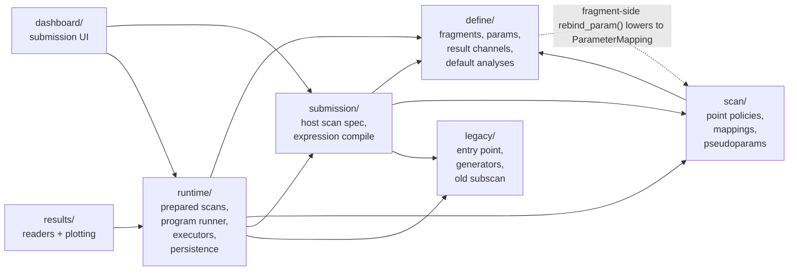
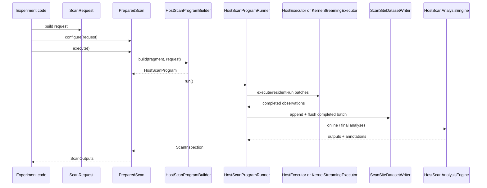
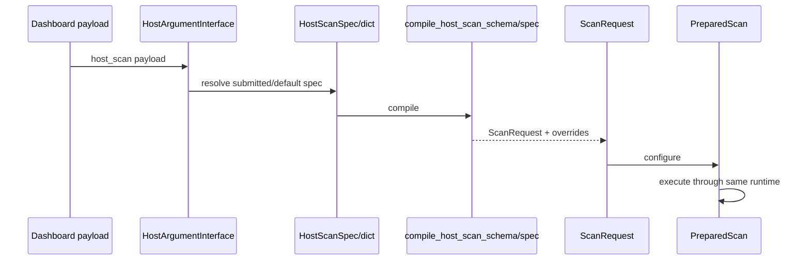
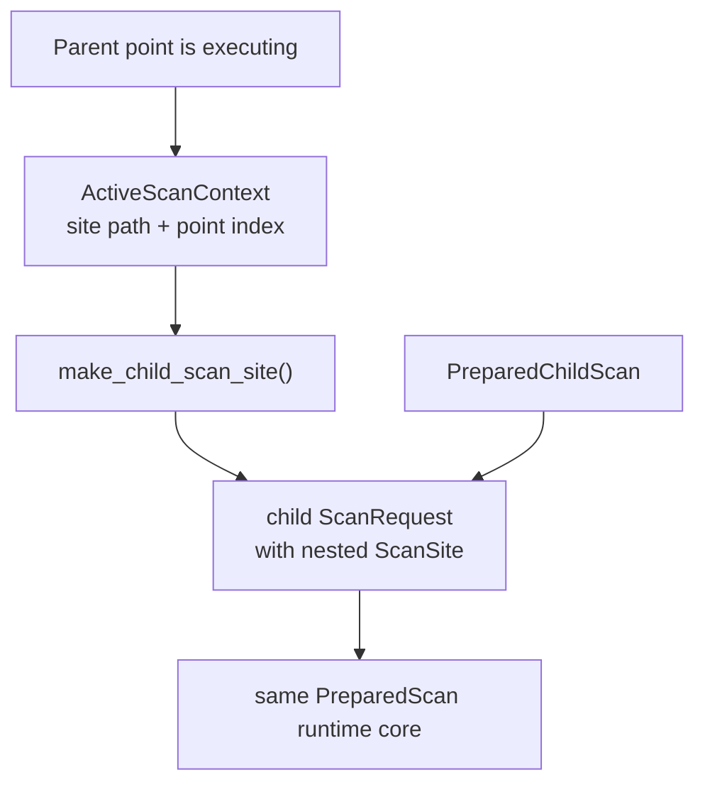
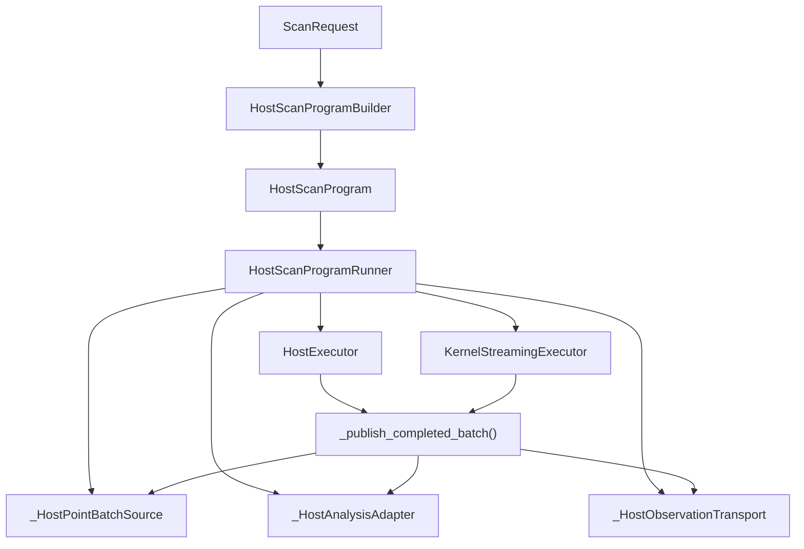

# Prepared Runtime Walkthrough

This note is for reading the new prepared-scan runtime as it exists today.

Short answer: yes, the library is now coherent enough to read through as a human, but
not by opening [`ndscan/runtime/api.py`](ndscan/runtime/api.py) and reading it top to
bottom with no guide.

The good news is that the runtime now has a fairly clean conceptual model:

- one prepared scan contract for root and nested scans,
- one host-directed controller,
- one batch boundary model,
- one stable output surface,
- two execution backends underneath (`HostExecutor` and
  `KernelStreamingExecutor`).

The main remaining problem is packaging, not semantics:

- [`ndscan/runtime/api.py`](ndscan/runtime/api.py) is still too large,
- some request-side concepts still live in `api.py`,
- a few boundaries that are conceptually separate are still physically colocated.

So the right way to read it is:

1. understand the model,
2. read the small supporting modules,
3. then read `api.py` in sections,
4. and only after that compare with the legacy runtime.

## Short Thesis

The new runtime is built around this idea:

- the host owns scan structure, point selection, batch boundaries, persistence, and
  analyses,
- the kernel, when used, is only an execution backend for the chosen point body,
- nested scans are just prepared scans inside prepared scans,
- both code-defined and dashboard-defined scans compile down to the same
  `ScanRequest` and execute through the same prepared runtime.

That is the key difference from the legacy design:

- the old runtime split "scan description", "execution style", and "nesting style"
  much more strongly,
- the new runtime tries to make them all flow through one runtime concept.

## The Main Mental Model

The runtime is easiest to understand if you keep the following stack in your head:

- `define/` defines what fragments, parameters, result channels, and default analyses
  are.
- `scan/` defines what a scan means logically: axes, pseudoparams, mappings, point
  policies.
- `submission/` compiles dashboard or typed submission specs into runtime objects.
- `runtime/` executes a prepared scan using either a host or resident-kernel
  executor.
- `legacy/` is the old generator/runner/subscan model and is now mostly there for
  compatibility and comparison.

In other words:

- `define` is experiment ontology,
- `scan` is scan semantics,
- `submission` is compilation,
- `runtime` is execution.

## Package Map

Two important notes about that diagram:

- `define -> scan` is mostly one deliberate seam: fragment-side rebinding lowers to
  the shared [`ParameterMapping`](ndscan/scan/mapping.py#L96) type instead of using a
  separate fragment-only mechanism.
- `results -> runtime` is a current implementation fact because persisted scan-site
  schema still lives in [`ndscan/runtime/persistence.py`](ndscan/runtime/persistence.py).
  That is a good candidate for a later `schema/` extraction.

## Read Order

If you want to understand the new runtime with the least backtracking, read the code
in this order.

### 1. Fragment and parameter model

Read these first:

- [`Fragment`](ndscan/define/fragment.py#L44)
- [`ExpFragment`](ndscan/define/fragment.py#L868)
- [`ParamHandle` and stores`](ndscan/define/parameters.py)
- [`ResultChannel`](ndscan/define/result_channels.py)

Why first:

- everything in the runtime ultimately manipulates fragment parameters and result
  channels,
- the runtime only makes sense once you understand `host_setup()`, `device_setup()`,
  `run_once()`, and how parameter stores behave.

### 2. Mappings and pseudoparams

Then read:

- [`ScanVariable`](ndscan/scan/mapping.py#L32)
- [`FixedPseudoparam`](ndscan/scan/mapping.py#L78)
- [`ParameterMapping`](ndscan/scan/mapping.py#L96)

Why second:

- a large part of the new runtime is built around the distinction between logical scan
  axes and concrete installed fragment parameters,
- this is also where fragment-side `rebind_param(...)` and ad hoc request-side
  mappings converge.

### 3. Point policies

Then read:

- [`PointPolicy`](ndscan/scan/point_policy.py#L136)
- one simple static policy such as
  [`ExplicitPointPolicy`](ndscan/scan/point_policy.py#L408)
- one compositional policy such as
  [`ProductPointPolicy`](ndscan/scan/point_policy.py#L536)
- one adaptive policy such as
  [`AskTellOptimiserPointPolicy`](ndscan/scan/point_policy.py#L207)

Why third:

- the runtime is host-directed, so point selection is one of the core extension
  seams,
- `PointPolicy` is the replacement for the old generator-centric mental model.

### 4. Persistence

Then read:

- [`ScanSite`](ndscan/runtime/persistence.py#L43)
- [`ScanSiteDatasetWriter`](ndscan/runtime/persistence.py#L95)

Why here:

- the runtime is batch-oriented, and a lot of the design only makes sense once you see
  that points are written as append-only observations into a flat site schema,
- nested scans are modelled structurally by scan-site paths and segments, not by a
  separate runner stack.

### 5. Analysis

Then read:

- [`HostScanAnalysisEngine`](ndscan/runtime/analysis.py#L65)

Why here:

- the runtime explicitly keeps analyses out of point execution,
- online and final analyses are both attached to completed batch boundaries rather than
  to the point body itself.

### 6. Runtime `api.py`, but in sections

Do not read [`ndscan/runtime/api.py`](ndscan/runtime/api.py) as one block. Read it in
this order:

1. value objects and request model:
   - [`ScanOutputs`](ndscan/runtime/api.py#L130)
   - [`ActiveScanContext`](ndscan/runtime/api.py#L173)
   - [`PreviewPolicy`](ndscan/runtime/api.py#L206)
   - [`ExecutionPolicy`](ndscan/runtime/api.py#L550)
   - [`ScanRequest`](ndscan/runtime/api.py#L578)
   - [`PointObservation`](ndscan/runtime/api.py#L825)
   - [`ScanInspection`](ndscan/runtime/api.py#L944)
2. runtime seams and batch-publication helpers:
   - [`_HostPointBatchSource`](ndscan/runtime/api.py#L1052)
   - [`_HostAnalysisAdapter`](ndscan/runtime/api.py#L1104)
   - [`_HostObservationTransport`](ndscan/runtime/api.py#L1144)
   - [`_publish_completed_batch()`](ndscan/runtime/api.py#L1244)
3. execution backends:
   - [`HostExecutor`](ndscan/runtime/api.py#L1372)
   - [`KernelStreamingExecutor`](ndscan/runtime/api.py#L1492)
   - [`_ResidentKernelPointRunner`](ndscan/runtime/api.py#L1652)
4. binding and program construction:
   - [`HostScanProgram`](ndscan/runtime/api.py#L1870)
   - [`_build_bound_axes()`](ndscan/runtime/api.py#L2005)
   - [`_collect_parameter_mappings()`](ndscan/runtime/api.py#L2110)
   - [`HostScanProgramBuilder`](ndscan/runtime/api.py#L2266)
   - [`HostScanProgramRunner`](ndscan/runtime/api.py#L2322)
5. prepared scan handles:
   - [`_PreparedScanHandleBase`](ndscan/runtime/api.py#L2582)
   - [`PreparedScan`](ndscan/runtime/api.py#L2679)
   - [`prepare_scan()`](ndscan/runtime/api.py#L2729)
   - [`PreparedChildScan`](ndscan/runtime/api.py#L2958)
   - [`prepare_child_scan()`](ndscan/runtime/api.py#L3415)
   - [`setattr_prepared_child_scan()`](ndscan/runtime/api.py#L3457)
6. experiment adapters and submission bridge:
   - [`PreparedScanExperiment`](ndscan/runtime/api.py#L3638)
   - [`PreparedDashboardScanExperiment`](ndscan/runtime/api.py#L3679)
   - [`make_fragment_prepared_scan_exp()`](ndscan/runtime/api.py#L3724)
   - [`make_fragment_prepared_dashboard_scan_exp()`](ndscan/runtime/api.py#L3771)
   - [`_resolve_host_scan_request_spec()`](ndscan/runtime/api.py#L3810)

### 7. Submission compiler

After you understand runtime execution, read:

- [`HostScanSpec`](ndscan/submission/host_scan_schema.py#L650)
- [`compile_host_scan_spec()`](ndscan/submission/host_scan_schema.py#L740)
- [`compile_host_scan_schema()`](ndscan/submission/host_scan_schema.py#L767)

Why after runtime:

- submission compilation is easier once you already know what object it is trying to
  produce,
- the key idea is simple: code-defined scans and dashboard-defined scans both end up as
  the same `ScanRequest`.

### 8. Legacy, only for comparison

Only then compare with:

- [`FragmentScanExperiment`](ndscan/legacy/entry_point.py#L103)
- [`TopLevelRunner`](ndscan/legacy/entry_point.py#L293)
- [`ScanRunner`](ndscan/legacy/scan_runner.py#L68)
- [`Subscan`](ndscan/legacy/subscan.py#L44)
- [`SubscanExpFragment`](ndscan/legacy/subscan.py#L742)

This is useful for understanding why the new design exists, but it is the wrong place
to start if you want to understand the prepared runtime itself.

## End-to-End Flow

### Code-defined root scan

### Dashboard-defined root scan

### Nested prepared scan

This is one of the core design wins: nested scans do not use a second runtime model.

## Internal Runtime Flow

The core of the runtime is the controller loop in
[`HostScanProgramRunner`](ndscan/runtime/api.py#L2322).

Its job is:

1. prepare the fragment once,
2. publish scan metadata once,
3. keep asking the point policy for the next batch,
4. run that batch through an executor,
5. publish the completed batch,
6. let analyses and the point policy observe the batch,
7. decide whether to continue, restart host context, pause, or finish.

The important thing is that batch boundaries are the only coordination boundary.

That is where the runtime:

- appends data,
- updates in-memory inspection state,
- runs online analyses,
- feeds back into adaptive point policies,
- writes previews,
- checks pause requests.

This is the design center of the runtime.

### Controller and backend split

This split is why the runtime can stay host-directed even with a kernel backend:

- the controller still lives on the host,
- only point execution moves behind an executor interface.

## Why The Design Looks Like This

### 1. Host-directed even with kernel execution

The runtime keeps point selection, persistence, analyses, and batch boundaries on the
host because those are the dynamic and stateful parts that benefit most from normal
Python and ordinary data structures.

The kernel backend is intentionally narrow:

- run a fixed point body efficiently,
- keep one resident compiled loop,
- ask the host for already-chosen batches via RPC.

This is why [`KernelStreamingExecutor`](ndscan/runtime/api.py#L1492) exists instead of
trying to make the kernel own the whole scan.

### 2. Batch boundaries are the only global synchronisation point

The runtime has chosen one global boundary to simplify reasoning:

- batches are the unit of feedback,
- batches are the unit of preview emission,
- batches are the unit of pause checking,
- batches are the unit of online-analysis publication,
- batches are the unit of persistence flush.

That is why `_publish_completed_batch()` is such a central helper in
[`ndscan/runtime/api.py`](ndscan/runtime/api.py#L1244).

### 3. Fixed outputs are the portable contract

The runtime now distinguishes:

- [`ScanOutputs`](ndscan/runtime/api.py#L130): the stable portable summary surface
- [`ScanInspection`](ndscan/runtime/api.py#L944): the host-only rich inspection object

This is a deliberate design decision.

The old host-oriented tendency was to let "the rich Python result object" define the
API. The new design makes that secondary. That is why prepared child scans prefer
`get_outputs()` / `outputs()` over an open-ended host result shape.

### 4. One mapping path

Fragment-side rebinding and request-side mappings are intentionally not separate
execution paths.

Both converge through:

- [`ParameterMapping`](ndscan/scan/mapping.py#L96)
- [`_collect_parameter_mappings()`](ndscan/runtime/api.py#L2110)
- [`_resolve_execution_point()`](ndscan/runtime/api.py#L3550)

That design is the reason pseudoparams, ad hoc mappings, and fragment rebinding all
compose naturally with the same executor logic.

### 5. Root and child scans use the same model

The root/child split is now structural, not semantic.

Both root and child use:

- `configure()`
- `execute()`
- `outputs()`
- `get_outputs()`
- `inspect()`

The difference is only:

- root scans are top-level prepared scans,
- child scans have extra nested-site shaping and a compiler-visible `acquire()` path.

That is why [`PreparedScan`](ndscan/runtime/api.py#L2679) and
[`PreparedChildScan`](ndscan/runtime/api.py#L2958) are worth reading together.

## Why This Was Chosen Over The Legacy Runtime

The old runtime had several ideas worth preserving:

- fixed nested scan structure matters for ARTIQ compilation,
- result-channel-based analyses are useful,
- subscans and top-level scans need related semantics.

But the legacy model also carried a few conceptual costs:

- a stronger split between host and kernel paths,
- a stronger split between top-level and subscan APIs,
- generator-centric scan description,
- a tendency for the rich host result shape to define the API.

The new runtime is trying to keep the good parts while changing the center of gravity:

- `ScanRequest` instead of generators as the main scan description,
- `PointPolicy` instead of generator classes as the point-selection abstraction,
- prepared handles instead of special nested runner categories,
- host/kernel as executor choices, not semantic modes,
- fixed outputs as the portable contract.

That is the core reason it is worth reading the new runtime first and the legacy
runtime second.

## Where `api.py` Is Still Too Big

[`ndscan/runtime/api.py`](ndscan/runtime/api.py) is coherent now, but it still bundles
too many responsibilities:

- public request/result types,
- scan/run context utilities,
- preview handling,
- runtime helper adapters,
- executors,
- program binding,
- prepared root/child handles,
- experiment adapters,
- submission-bridge helpers.

So the file is understandable, but not yet nicely packaged.

If you want to refactor further after reading, the next split I would make is:

### 1. `runtime/context.py`

Move:

- [`ActiveScanContext`](ndscan/runtime/api.py#L173)
- [`PreviewPolicy`](ndscan/runtime/api.py#L206)
- [`PreviewCoordinator`](ndscan/runtime/api.py#L238)
- [`RunContext`](ndscan/runtime/api.py#L342)
- context stack helpers

### 2. `runtime/request.py`

Move:

- [`ExecutionPolicy`](ndscan/runtime/api.py#L550)
- [`ScanRequest`](ndscan/runtime/api.py#L578)
- perhaps `ScanOutputs` and `ScanInspection`

Longer-term, this probably belongs under `ndscan.scan`, not under `runtime`.

### 3. `runtime/program.py`

Move:

- bound axis/parameter/channel types
- [`HostScanProgram`](ndscan/runtime/api.py#L1870)
- builder helpers such as `_build_bound_axes()`
- [`HostScanProgramBuilder`](ndscan/runtime/api.py#L2266)

### 4. `runtime/executors.py`

Move:

- [`HostExecutor`](ndscan/runtime/api.py#L1372)
- [`KernelStreamingExecutor`](ndscan/runtime/api.py#L1492)
- [`_ResidentKernelPointRunner`](ndscan/runtime/api.py#L1652)
- `_PointInvocationRunner`
- `_ResidentKernelBatchState`

### 5. `runtime/prepared.py`

Move:

- [`PreparedScan`](ndscan/runtime/api.py#L2679)
- [`PreparedChildScan`](ndscan/runtime/api.py#L2958)
- `prepare_scan()`
- `prepare_child_scan()`
- `setattr_prepared_child_scan()`

### 6. `runtime/adapters.py`

Move:

- [`PreparedScanExperiment`](ndscan/runtime/api.py#L3638)
- [`PreparedDashboardScanExperiment`](ndscan/runtime/api.py#L3679)
- helper factories
- `_resolve_host_scan_request_spec()`

That would not materially change the design. It would just make the design easier to
see in code.

## What To Read If You Only Have One Hour

If you want the shortest useful reading pass, do this:

1. [`ndscan/scan/mapping.py`](ndscan/scan/mapping.py)
2. [`ndscan/scan/point_policy.py`](ndscan/scan/point_policy.py)
3. [`ndscan/runtime/persistence.py`](ndscan/runtime/persistence.py)
4. [`ndscan/runtime/analysis.py`](ndscan/runtime/analysis.py)
5. [`ScanRequest`](ndscan/runtime/api.py#L578)
6. [`HostExecutor`](ndscan/runtime/api.py#L1372)
7. [`KernelStreamingExecutor`](ndscan/runtime/api.py#L1492)
8. [`HostScanProgramRunner`](ndscan/runtime/api.py#L2322)
9. [`PreparedScan`](ndscan/runtime/api.py#L2679)
10. [`PreparedChildScan`](ndscan/runtime/api.py#L2958)

That gives you the design center of the new runtime without drowning you in adapter
code.

## Final Verdict

The runtime is now at the point where it can be understood as one system.

I would describe the situation like this:

- the semantics are now coherent,
- the interfaces are now visible,
- the host/kernel story is now unified enough to explain,
- but `api.py` is still physically too large and should still be split.

So the right next step is not "invent a new model again". The right next step is:

- read the runtime using this guide,
- then split `api.py` along the seams that already exist.
