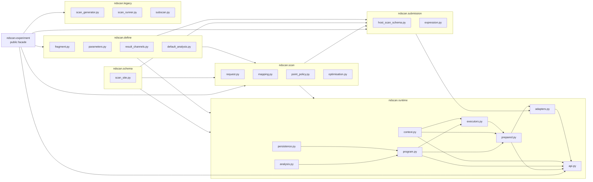
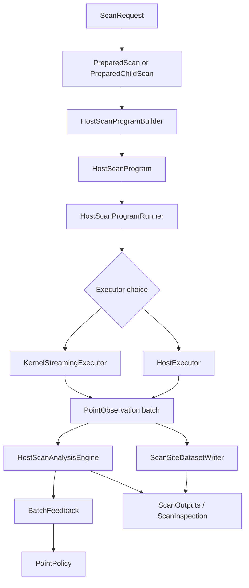
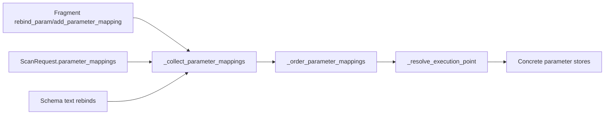
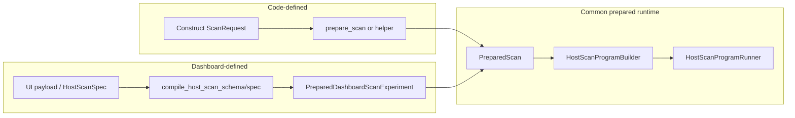

# Prepared Runtime Walkthrough

This is the current readthrough guide for the new prepared-scan runtime.

It is written for the code as it exists now, after the split into:

- `ndscan/define`
- `ndscan/scan`
- `ndscan/schema`
- `ndscan/submission`
- `ndscan/runtime`
- `ndscan/legacy`

It replaces the older mental model where the implementation lived mostly in one
large `host_runtime.py` or one large `runtime/api.py`.


## Short Thesis

The current runtime is easiest to understand if you treat it as:

- one scan description model: `ScanRequest`
- one prepared execution model: `PreparedScan` / `PreparedChildScan`
- one host-controlled batch model
- two execution backends:
  - host point execution
  - resident kernel point execution

The important design choice is that host and kernel are no longer different scan
models. They are different executors underneath the same prepared-scan contract.


## Start Here

If you only want the fastest route to understanding, read these files in order:

1. [`ndscan/define/fragment.py`](ndscan/define/fragment.py)
2. [`ndscan/define/parameters.py`](ndscan/define/parameters.py)
3. [`ndscan/define/result_channels.py`](ndscan/define/result_channels.py)
4. [`ndscan/scan/request.py`](ndscan/scan/request.py)
5. [`ndscan/scan/mapping.py`](ndscan/scan/mapping.py)
6. [`ndscan/scan/point_policy.py`](ndscan/scan/point_policy.py)
7. [`ndscan/schema/scan_site.py`](ndscan/schema/scan_site.py)
8. [`ndscan/runtime/program.py`](ndscan/runtime/program.py)
9. [`ndscan/runtime/executors.py`](ndscan/runtime/executors.py)
10. [`ndscan/runtime/prepared.py`](ndscan/runtime/prepared.py)
11. [`ndscan/runtime/adapters.py`](ndscan/runtime/adapters.py)

Read these later:

- [`ndscan/runtime/context.py`](ndscan/runtime/context.py)
- [`ndscan/runtime/analysis.py`](ndscan/runtime/analysis.py)
- [`ndscan/runtime/persistence.py`](ndscan/runtime/persistence.py)
- [`ndscan/submission/host_scan_schema.py`](ndscan/submission/host_scan_schema.py)
- [`ndscan/runtime/api.py`](ndscan/runtime/api.py)

Do not start with [`ndscan/runtime/api.py`](ndscan/runtime/api.py). It is now
deliberately a facade.


## Package Map




## The Runtime In One Picture




## Recommended Reading Order

### 1. Fragment Authoring Layer

Start with:

- [`ndscan/define/fragment.py`](ndscan/define/fragment.py)
- [`ndscan/define/parameters.py`](ndscan/define/parameters.py)
- [`ndscan/define/result_channels.py`](ndscan/define/result_channels.py)

What to understand:

- what an `ExpFragment` is
- how parameters are declared and bound to stores
- how result channels are declared and pushed to
- that default analyses are still fragment-defined

Why first:

- the prepared runtime never invents a second fragment model
- it only binds scan requests onto ordinary fragments


### 2. Scan Semantics Layer

Read:

- [`ndscan/scan/request.py`](ndscan/scan/request.py)
- [`ndscan/scan/mapping.py`](ndscan/scan/mapping.py)
- [`ndscan/scan/point_policy.py`](ndscan/scan/point_policy.py)

Focus on:

- `PreviewPolicy`
- `ExecutionPolicy`
- `ScanRequest`
- `ScanVariable`
- `FixedPseudoparam`
- `ParameterMapping`
- `PointPolicy`
- `BatchFeedback`

This is where the runtime’s core semantic choices live:

- request shape and preview/batch policy are scan-level concepts
- logical scan variables are first-class
- fragment-side rebinds and request-side mappings share one mapping object
- adaptive scans are expressed as point policies, not legacy generators

This is one of the strongest parts of the new design. The runtime later executes
these semantics; it does not define them.


### 3. Persisted Schema Layer

Read:

- [`ndscan/schema/scan_site.py`](ndscan/schema/scan_site.py)

Focus on:

- `SCAN_SITE_SCHEMA_REVISION`
- `ScanSite`
- `make_scan_site_prefix()`

This module matters outside the runtime itself. It is shared knowledge for:

- dashboard plotting tools
- matplotlib plotting tools
- results readers
- tests
- runtime writers

That is why it no longer lives only in the runtime writer module.


### 4. Program Layer

Read:

- [`ndscan/runtime/program.py`](ndscan/runtime/program.py)

Read it in this order:

1. `ScanOutputs`
2. `PointObservation`
3. `ScanInspection`
4. `HostScanProgram`
5. `_collect_parameter_mappings()`
6. `_resolve_execution_point()`

This file answers three questions:

- what is the stable public scan result surface?
- how does a request become a validated bound program?
- how does one logical point become concrete parameter values?

Important types:

- `ScanOutputs`
  - stable named output ABI
- `ScanInspection`
  - host-only rich inspection artifact
- `HostScanProgram`
  - validated, bound execution plan

Important design decision:

- `ScanOutputs` is the API
- `ScanInspection` is an inspection/debug artifact

That split is deliberate. The old runtime tended to let rich host-side result
objects define the model. The new runtime does not.


## How Mappings Actually Work



This is important because it is one of the reasons the new structure is simpler
than it first appears. There is only one real mapping execution path.


### 5. Persistence and Analysis Sidecars

Read:

- [`ndscan/runtime/persistence.py`](ndscan/runtime/persistence.py)
- [`ndscan/runtime/analysis.py`](ndscan/runtime/analysis.py)

These are sidecars, not the control loop itself.

`persistence.py` owns:

- `ScanSiteDatasetWriter`

`analysis.py` owns:

- `HostScanAnalysisEngine`

The point of the split is:

- the executor loop decides when batches complete
- the writer decides how those completed observations are written
- the analysis engine decides how accumulated observations become analysis outputs

This separation is cleaner than the legacy setup where sink wiring and runtime flow
were more entangled.


### 6. Runtime Context

Read:

- [`ndscan/runtime/context.py`](ndscan/runtime/context.py)

Focus on:

- `ActiveScanContext`
- `RunContext`
- `make_child_scan_site()`

This file is small but conceptually important.

It owns runtime-wide state that should not live in the executors:

- preview snapshot coordination
- root run context
- current active parent point for nested scans
- child scan site placement

This is why nested scans and preview HDF5 snapshots work without every executor
having to reinvent the same bookkeeping.


### 7. Execution Backends and Main Loop

Read:

- [`ndscan/runtime/executors.py`](ndscan/runtime/executors.py)

Read it in this order:

1. `_execute_scan_request_inspection()`
2. `HostScanProgramBuilder`
3. `HostScanProgramRunner`
4. `HostExecutor`
5. `KernelStreamingExecutor`
6. `_ResidentKernelPointRunner`

This is the core runtime loop.

`HostScanProgramBuilder` does validation and binding:

- bind axes
- collect saved result channels
- validate mappings
- decide whether kernel streaming is even eligible
- create the `HostScanProgram`

`HostScanProgramRunner` owns the run:

- root preview / run context
- metadata publication
- executor selection
- batch-finalisation boundary
- final analysis
- close/complete handling

`HostExecutor` and `KernelStreamingExecutor` are peers. That is the key model:

- same `HostScanProgram`
- same `ScanRequest`
- same batch-finalisation contract
- different point-body execution backend


## Host vs Kernel Execution

```mermaid
flowchart TD
    PROG[HostScanProgram]
    RUN[HostScanProgramRunner]
    ELIGIBLE{_can_use_kernel_streaming_executor?}
    HOST[HostExecutor]
    KERN[KernelStreamingExecutor]
    POLICY[point_source.next_batch()]
    RESOLVE[_resolve_execution_point/_resolve_execution_batch]
    BODY[fragment.device_setup/run_once/device_cleanup]
    FINALIZE[_publish_completed_batch]

    PROG --> RUN
    RUN --> ELIGIBLE
    ELIGIBLE -->|no| HOST
    ELIGIBLE -->|yes| KERN
    HOST --> POLICY
    HOST --> RESOLVE
    HOST --> BODY
    HOST --> FINALIZE
    KERN --> POLICY
    KERN --> RESOLVE
    KERN --> BODY
    KERN --> FINALIZE
```

Why this design:

- host point choice remains simple and expressive
- kernel execution gets the high-performance path when eligible
- there is still one runtime concept

This is better than a host runtime and a kernel runtime diverging semantically.


### 8. Prepared Handles

Read:

- [`ndscan/runtime/prepared.py`](ndscan/runtime/prepared.py)

Read it in this order:

1. `_PreparedScanHandleBase`
2. `PreparedScan`
3. `_prepare_child_scan_request()`
4. `_scan_outputs_from_inspection()`
5. `_PreparedChildKernelAcquireSession`
6. `PreparedChildScan`
7. `prepare_scan()`
8. `prepare_child_scan()`
9. `setattr_prepared_child_scan()`

This file is the prepared-scan API layer.

The important thing to notice is that root and child scans now share the same
host-side contract:

- `configure()`
- `execute()`
- `outputs()`
- `inspect()`
- `get_outputs()` when fixed outputs are declared

The only real extra complexity in `PreparedChildScan` is the kernel `acquire()`
path, because ARTIQ needs a prepared child session with a fixed compiler-visible
shape.

That is what `_PreparedChildKernelAcquireSession` now isolates.


## Nested Prepared Child Flow

```mermaid
flowchart TD
    PARENT[Parent fragment]
    CHILD[PreparedChildScan]
    CFG[configure(request)]
    EXEC[execute() or acquire()]
    PREQ[_prepare_child_scan_request]
    SESSION[_PreparedChildKernelAcquireSession]
    BUILD[HostScanProgramBuilder]
    RUNNER[_ResidentKernelPointRunner]
    PUB[_publish_completed_batch]
    OUT[get_outputs / outputs / inspect]

    PARENT --> CHILD
    CHILD --> CFG
    CFG --> EXEC
    EXEC --> PREQ
    PREQ --> BUILD
    BUILD -->|host path| PUB
    BUILD -->|kernel child path| SESSION
    SESSION --> RUNNER
    RUNNER --> PUB
    PUB --> OUT
```

This is where the new runtime is better than both old subscan styles:

- composition-oriented API like the old handle-based style
- fixed prepared kernel execution shape like the old `SubscanExpFragment` idea
- without making nested scans a separate runtime


### 9. Experiment / Dashboard Adapters

Read:

- [`ndscan/runtime/adapters.py`](ndscan/runtime/adapters.py)

Focus on:

- `PreparedScanExperiment`
- `PreparedDashboardScanExperiment`
- `HostArgumentInterface`
- `_resolve_code_request_spec()`
- `_resolve_dashboard_request_spec()`

These are front doors, not the core runtime.

The code path is now intentionally narrower:

- code-defined prepared scans accept:
  - `ScanRequest`
  - `(ScanRequest, overrides)`
- dashboard-defined prepared scans accept:
  - `HostScanSpec`
  - dashboard transport dict schema

The dashboard path compiles into a `ScanRequest` before it enters the prepared
runtime. That is the important convergence point.


## Code vs Dashboard



This is one of the central design wins.

The dashboard path is not a different runtime. It is just a different request
construction path.


### 10. Public Facades

Read last:

- [`ndscan/runtime/api.py`](ndscan/runtime/api.py)
- [`ndscan/experiment/__init__.py`](ndscan/experiment/__init__.py)

These files are useful for finding public names, but they are not where the
interesting logic lives anymore.

That is intentional.


## Good Example Files

Use these after reading the modules:

- [`examples/host_runtime_prepared_root_linear_scan.py`](examples/host_runtime_prepared_root_linear_scan.py)
  - clearest explicit root `PreparedScan`
- [`examples/host_runtime_prepared_kernel_nested.py`](examples/host_runtime_prepared_kernel_nested.py)
  - nested prepared kernel path
- [`examples/host_runtime_prepared_kernel_nested_ttl.py`](examples/host_runtime_prepared_kernel_nested_ttl.py)
  - real device leaf with host-chosen points and one resident kernel region
- [`examples/host_runtime_prepared_kernel_online_fit.py`](examples/host_runtime_prepared_kernel_online_fit.py)
  - prepared child fixed outputs
- [`examples/host_runtime_kernel_bayesian_optimisation.py`](examples/host_runtime_kernel_bayesian_optimisation.py)
  - host-driven BO with kernel-backed objective evaluation
- [`examples/host_runtime_parameter_mapping_schema.py`](examples/host_runtime_parameter_mapping_schema.py)
  - schema compilation into the same runtime


## Why These Design Decisions Were Made

### One runtime, not separate host and kernel semantics

The old direction made it too easy for host execution and kernel execution to drift
into different mental models.

The new runtime instead says:

- host chooses batches
- runtime binds points to concrete parameter values
- executor backend runs point bodies

That applies on both host and kernel.


### Prepared handles rather than dynamic subscan helpers

Prepared handles are better because they give:

- fixed call paths
- fixed output contracts
- ARTIQ-compiler-visible structure
- the same root/child contract

That is why `PreparedScan` and `PreparedChildScan` are now the main API.


### `ScanOutputs` over rich result objects

The stable contract is:

- execute the scan
- read declared outputs

Host-side rich inspection still exists, but it is now secondary:

- useful for debugging
- useful for tests
- not the thing that defines the scan model


### One mapping path

The mapping system is better than it first looks because fragment-side rebindings and
request-side mappings are not two execution mechanisms. They converge before point
execution.

That is simpler than trying to keep separate “fragment mappings” and “request
mappings” alive all the way through runtime execution.


### Batches everywhere

The runtime now consistently treats the batch as the execution boundary for:

- persistence
- preview snapshots
- online analysis
- adaptive feedback
- scheduler pause points

That is a cleaner model than mixing point-by-point execution with unrelated flush
and feedback behavior.


## Where To Look For Specific Questions

If you want to answer:

- “How is a point policy asked for work?”
  - [`ndscan/runtime/program.py`](ndscan/runtime/program.py)
  - `_HostPointBatchSource`

- “How does a logical point become concrete parameter values?”
  - [`ndscan/runtime/program.py`](ndscan/runtime/program.py)
  - `_resolve_execution_point()`

- “Where is kernel eligibility decided?”
  - [`ndscan/runtime/program.py`](ndscan/runtime/program.py)
  - `_can_use_kernel_streaming_executor()`
  - [`ndscan/runtime/executors.py`](ndscan/runtime/executors.py)
  - `HostScanProgramBuilder`

- “Where is the one-resident-kernel loop?”
  - [`ndscan/runtime/executors.py`](ndscan/runtime/executors.py)
  - `KernelStreamingExecutor`
  - `_ResidentKernelPointRunner`

- “Where do nested child scans become segmented child sites?”
  - [`ndscan/runtime/prepared.py`](ndscan/runtime/prepared.py)
  - `_prepare_child_scan_request()`
  - [`ndscan/runtime/context.py`](ndscan/runtime/context.py)
  - `make_child_scan_site()`

- “Where are fixed outputs declared and enforced?”
  - [`ndscan/runtime/prepared.py`](ndscan/runtime/prepared.py)
  - `_resolve_declared_scan_output_channels()`
  - `_scan_outputs_from_inspection()`
  - `_make_prepared_child_get_outputs_methods()`

- “Where does the dashboard path become a `ScanRequest`?”
  - [`ndscan/runtime/adapters.py`](ndscan/runtime/adapters.py)
  - `HostArgumentInterface.resolve_request()`
  - [`ndscan/submission/host_scan_schema.py`](ndscan/submission/host_scan_schema.py)
  - `compile_host_scan_schema()`
  - `compile_host_scan_spec()`

- “Where are scan-site datasets written?”
  - [`ndscan/runtime/persistence.py`](ndscan/runtime/persistence.py)
  - `ScanSiteDatasetWriter`

- “Where is the persisted scan-site schema defined?”
  - [`ndscan/schema/scan_site.py`](ndscan/schema/scan_site.py)


## What To Ignore On First Read

Skip these until the main model is clear:

- optional optimisation backends in [`ndscan/scan/optimisation.py`](ndscan/scan/optimisation.py)
- preview snapshot details in [`ndscan/runtime/context.py`](ndscan/runtime/context.py)
- exact dataset-key details in [`ndscan/runtime/persistence.py`](ndscan/runtime/persistence.py)
- old runtime code in [`ndscan/legacy`](ndscan/legacy)

Those are important, but they are not the conceptual core.


## Legacy Comparison

Read these only after the new runtime makes sense:

- [`ndscan/legacy/scan_generator.py`](ndscan/legacy/scan_generator.py)
- [`ndscan/legacy/scan_runner.py`](ndscan/legacy/scan_runner.py)
- [`ndscan/legacy/subscan.py`](ndscan/legacy/subscan.py)

The modern runtime is better understood as:

- composition like legacy handle-based subscans
- prepared compiler-visible kernel execution like legacy `SubscanExpFragment`
- but under one cleaner runtime model

That is why the new runtime ended up split across `scan/`, `submission/`, and
`runtime/` instead of trying to evolve the legacy runner in place.


## Current Rough Edges

The runtime is now readable, but there are still a few structural oddities worth
keeping in mind:

- [`ndscan/runtime/persistence.py`](ndscan/runtime/persistence.py) still mixes the
  site writer with some schema-adjacent details like metadata-key conventions
- [`ndscan/runtime/prepared.py`](ndscan/runtime/prepared.py) is still the largest
  “API plus machinery” file because child kernel acquisition is intrinsically awkward

These are refactor candidates, not design crises.


## Suggested Second Pass

After reading the files above once, the most useful second pass is:

1. read [`ndscan/runtime/prepared.py`](ndscan/runtime/prepared.py) again
2. read [`ndscan/runtime/executors.py`](ndscan/runtime/executors.py) again
3. then compare with:
   - [`PREPARED_SCAN_MODEL_NOTES.md`](PREPARED_SCAN_MODEL_NOTES.md)
   - [`MODULE_NAMESPACE_TIDYUP.md`](MODULE_NAMESPACE_TIDYUP.md)

That gives you:

- the concrete code path
- the design rationale
- the module-boundary rationale


## Bottom Line

The prepared runtime is now in a form where a human can read it coherently, but only
if they read it by layers:

- fragment definition
- scan semantics
- persisted schema
- program binding
- executors
- prepared handles
- adapters

If you read it in that order, the current runtime should look like one system.

If you start from the public facades or from legacy modules, it will still feel more
complicated than it really is.
