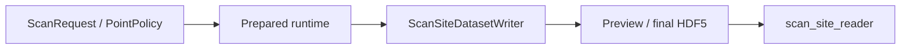
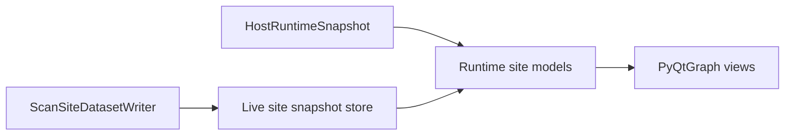
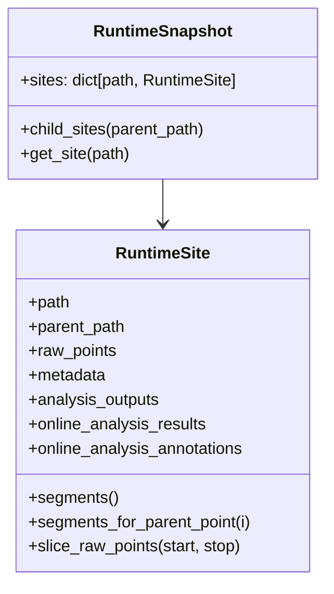
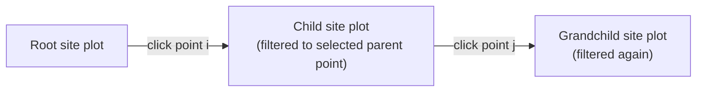
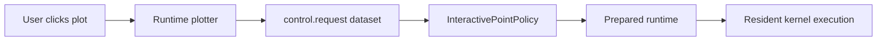

# Runtime Plotting Design

This note proposes a new plotting path for the prepared runtime.

It is intentionally narrower than the old applet model. The goal is to get a good
live/offline viewer for the new site-based schema first, not to preserve every shape of
the legacy plotting stack.

## Goals

The initial runtime plotter should support:

- live point updates as batches complete
- `x` dropdown: any scanned variable in the current site
- `y` dropdown: any result channel in the current site
- point selection opening child subscans to the right, recursively
- fit/analysis overlays when the runtime schema exposes them
- optional click-to-suggest interaction by writing a dataset that the runtime reads at
  batch boundaries

It should not initially try to support every legacy plotting mode.

## Why A New Runtime Plotter

The current plotting code is still shaped around the legacy flat dataset model:

- live root/subscan discovery is driven by flat dataset prefixes in
  [ndscan/plots/model/subscriber.py](/home/lab/artiq-files/install/ndscan/ndscan/plots/model/subscriber.py)
- child subscans are modeled as special point-embedded payloads in
  [ndscan/plots/model/subscan.py](/home/lab/artiq-files/install/ndscan/ndscan/plots/model/subscan.py)
- offline HDF5 plotting in
  [ndscan/plots/model/hdf5.py](/home/lab/artiq-files/install/ndscan/ndscan/plots/model/hdf5.py)
  is also legacy-schema-shaped

The prepared runtime now has a better structural source of truth:

- append-only site raw points in
  [ndscan/runtime/persistence.py](/home/lab/artiq-files/install/ndscan/ndscan/runtime/persistence.py)
- a site tree and segment model in
  [ndscan/schema/scan_site.py](/home/lab/artiq-files/install/ndscan/ndscan/schema/scan_site.py)
- an offline reader that already understands that tree in
  [ndscan/results/scan_site_reader.py](/home/lab/artiq-files/install/ndscan/ndscan/results/scan_site_reader.py)

So the right move is:

- keep `ndscan.plots.legacy` for the old runtime
- build `ndscan.plots.runtime` around the site tree

Not a total rewrite of all widgets, but a new model layer.

## Main Design Decision

The runtime plotter should treat nested scans as **child sites**, not as special
"subscan result channels".

That means:

- root plot = one site
- selected child plot = a slice of one child site
- recursive nesting = follow `site.parent_path`
- per-parent child data = slice child-site flat arrays by
  `segments.parent_point_index`

This matches the current schema directly.

## Existing Runtime Shape

The current runtime pipeline is:



The new plotter should plug in at the same writer/schema boundary:



The key point is that live and offline should converge onto the same logical site-tree
model.

## Proposed Package Layout

```text
ndscan/plots/
  legacy/
    ...
  runtime/
    __init__.py
    live.py
    offline.py
    snapshot.py
    models.py
    columns.py
    controls.py
    annotations.py
```

Suggested responsibilities:

- `runtime.snapshot`
  - mutable in-memory site tree for live plotting
  - runtime equivalent of `HostRuntimeSnapshot`
- `runtime.live`
  - dataset subscriber that updates the mutable snapshot
- `runtime.offline`
  - adapter from `HostRuntimeSnapshot` to the same model interfaces
- `runtime.models`
  - `SiteRoot`, `SiteScanModel`, `SegmentSliceModel`, selection helpers
- `runtime.columns`
  - recursive "subscans open to the right" UI
- `runtime.controls`
  - x/y dropdowns, child-site selector, interactive click-to-suggest
- `runtime.annotations`
  - bridge from runtime analysis annotations to existing plot annotation items

Shared plot widgets such as
[ndscan/plots/xy_1d.py](/home/lab/artiq-files/install/ndscan/ndscan/plots/xy_1d.py),
[ndscan/plots/image_2d.py](/home/lab/artiq-files/install/ndscan/ndscan/plots/image_2d.py),
and [ndscan/plots/annotation_items.py](/home/lab/artiq-files/install/ndscan/ndscan/plots/annotation_items.py)
should be reused where sensible.

## Data Model

The runtime plotter should be built around these schema facts:

- each site has a stable path: `site.path`
- child sites point back to their parent site with `site.parent_path`
- site raw point arrays live under `points.*`
- segmented child scans record:
  - `segments.start_index`
  - `segments.parent_point_index`
  - optionally `segments.start_unix_time`
- run completion is `state.completed`

This is already exposed to offline tooling by
[HostRuntimeSite](/home/lab/artiq-files/install/ndscan/ndscan/results/scan_site_reader.py#L147).

The live in-memory model should look very similar:



The point is not to invent a new structure. It is to make the live side look like the
offline side.

## UI Layout

The MVP UI can stay simple.

Column 0:

- one plot for the chosen root site
- x selector
- y selector
- analysis overlay toggle if available

Clicking a point:

- selects a flat source point index in the current site
- reveals a column to the right for that point's child sites

Column N:

- represents one selected child site path under the current parent
- plots only the segments launched from the selected parent point
- has its own x/y dropdowns
- can itself be clicked to open another child column

If multiple child site types exist at the same level, the column header should have a
child-site dropdown. If only one exists, no extra selector is needed.



## X And Y Selection

For the current site:

- `x` candidates:
  - pseudoparams from `scan.pseudoparams`
  - scanned parameters from `scan.parameters`
- `y` candidates:
  - channels from `scan.channels`

MVP policy:

- default `x`: first pseudoparam, otherwise first scanned parameter
- default `y`: first result channel

This matches the current offline helper logic in
[HostRuntimeSite.choose_default_x_key()](/home/lab/artiq-files/install/ndscan/ndscan/results/scan_site_reader.py#L174),
just extended to explicit dropdowns.

## Child-Site Slicing

The important part of nested plotting is not a new plot type, but a filter.

Given:

- selected parent point index `p`
- child site `S`

the plotter should:

1. find `S.segments_for_parent_point(p)`
2. take the corresponding flat point slices
3. concatenate those slices for display

That gives the visual effect of "show me the child scan(s) launched from this point"
without requiring special nested datasets.

For this reason, the core nested model should be something like:

- `SiteScanModel(site)`
- `SegmentSliceModel(site, parent_point_index)`

not a special `SubscanModel`.

## Fit And Analysis Overlays

The runtime schema already publishes:

- final annotations: `analysis.annotations`
- latest online analysis result objects:
  `analysis.online_result.<name>`
- latest online analysis annotations:
  `analysis.online_annotation.<name>`

The new runtime plotter should prefer annotations as the overlay contract. That lets it
reuse [ndscan/plots/annotation_items.py](/home/lab/artiq-files/install/ndscan/ndscan/plots/annotation_items.py)
instead of teaching each widget about fit-specific result shapes.

So the MVP overlay logic is:

- if site-level annotations exist, show them
- if online-analysis annotations exist, show the latest set
- do not add a separate fit-specific plotting protocol yet

This keeps the plotting contract narrow.

## Live Update Strategy

For live plotting, the new plotter should maintain a mutable site snapshot updated from
dataset changes.

It should not try to infer nested structure from flat point payloads. It should watch
site-prefixed datasets directly.

Expected updates:

- metadata appears first
- `points.*` arrays append over time
- `analysis.online_result.*` and `analysis.online_annotation.*` are rewritten at batch
  boundaries
- `state.completed` flips to `true` at the end of a successful run

Failed/incomplete runs are already represented cleanly by the schema:

- only completed points are appended
- `state.completed` stays `false`

So the live model should preserve that behavior and show partial plots rather than
inventing placeholder failed points.

## Interactive Click-To-Suggest

There is already a precedent for plot-side dataset writes via
[Context.set_dataset()](/home/lab/artiq-files/install/ndscan/ndscan/plots/model/__init__.py#L71),
used today for crosshair-to-dataset actions in
[xy_1d.py](/home/lab/artiq-files/install/ndscan/ndscan/plots/xy_1d.py#L561) and
[image_2d.py](/home/lab/artiq-files/install/ndscan/ndscan/plots/image_2d.py#L489).

The runtime-aware version should use the same mechanism, but with a dedicated control
dataset protocol.

### Why datasets are the right control boundary

- applet already has a master connection
- runtime already owns host-side batch boundaries
- the runtime does not need a second transport channel
- one resident kernel session is preserved, because point choice is still host-owned

### MVP interaction model

When the user clicks in a plot, the viewer can offer:

- `Suggest point here`
- later: `Run this point next`

The plotter writes a control dataset for the active site. The runtime polls that
dataset before asking the point policy for the next batch.

### Proposed control datasets

Under each site prefix:

- `control.request`
- `control.last_consumed_seq`

`control.request` is a JSON object, for example:

```json
{
  "seq": 7,
  "pending": [
    {
      "kind": "suggest_point",
      "site_path": ["scan_p", "scan_x"],
      "axis_values": {
        "x": 1.25
      },
      "insert": "front"
    }
  ]
}
```

`control.last_consumed_seq` is written by the runtime after it has consumed the current
request.

This is deliberately simple:

- one writer at a time
- no streaming queue protocol
- one batch-boundary poll loop in the runtime

### Runtime hook

The clean runtime seam is a wrapper point policy, for example:

- `InteractivePointPolicy(inner, control_reader)`

Behavior:

- on `next_batch(max_points)`, poll the control dataset
- if there are pending suggested points for this site, emit them first
- otherwise delegate to `inner.next_batch(max_points)`
- after consuming, write `control.last_consumed_seq`

This keeps the interactive feature out of executors and out of kernel code.



## Reading Order In The Current Code

If you want to build this, read the code in this order:

1. Runtime write-side schema
   - [ndscan/runtime/persistence.py](/home/lab/artiq-files/install/ndscan/ndscan/runtime/persistence.py)
2. Offline site-tree reader
   - [ndscan/results/scan_site_reader.py](/home/lab/artiq-files/install/ndscan/ndscan/results/scan_site_reader.py)
3. Point-policy batch boundary
   - [ndscan/scan/point_policy.py](/home/lab/artiq-files/install/ndscan/ndscan/scan/point_policy.py)
   - [ndscan/runtime/program.py](/home/lab/artiq-files/install/ndscan/ndscan/runtime/program.py)
4. Current plot model abstractions
   - [ndscan/plots/model/__init__.py](/home/lab/artiq-files/install/ndscan/ndscan/plots/model/__init__.py)
5. Current point-click behavior
   - [ndscan/plots/xy_1d.py](/home/lab/artiq-files/install/ndscan/ndscan/plots/xy_1d.py)
   - [ndscan/plots/image_2d.py](/home/lab/artiq-files/install/ndscan/ndscan/plots/image_2d.py)
6. Current legacy live model, mainly as a contrast
   - [ndscan/plots/model/subscriber.py](/home/lab/artiq-files/install/ndscan/ndscan/plots/model/subscriber.py)
   - [ndscan/plots/model/subscan.py](/home/lab/artiq-files/install/ndscan/ndscan/plots/model/subscan.py)

## Suggested Implementation Order

1. Create `ndscan.plots.runtime.snapshot`
   - live mutable equivalent of `HostRuntimeSnapshot`
2. Create `ndscan.plots.runtime.models`
   - `SiteRoot`
   - `SiteScanModel`
   - `SegmentSliceModel`
3. Build an offline demo first
   - feed it from `read_host_runtime_snapshot(...)`
4. Add a live dataset subscriber
   - feed the same runtime models
5. Add the recursive right-column UI
6. Add annotation overlays
7. Add the dataset-based click-to-suggest control path

This order matters. It gets the static site-tree model right before adding live update
and interaction complexity.

## What Not To Do First

Do not start by:

- extending `ndscan/plots/model/subscan.py`
- making the runtime write fake nested point payloads for the plotter
- adding fit-specific schema separate from annotations
- pushing click events directly into executors

Those would all pull the new runtime back toward legacy plot assumptions.

## Short Version

The MVP runtime plotter should be:

- a site-tree plotter, not a subscan-channel plotter
- live/offline unified at the model layer
- recursive by child-site slicing
- annotation-driven for fits
- optionally interactive by writing a control dataset read at batch boundaries

That is enough to satisfy the initial requirements without overdesigning the first
version.
