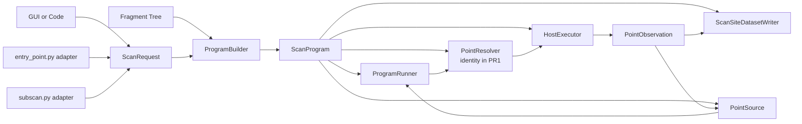
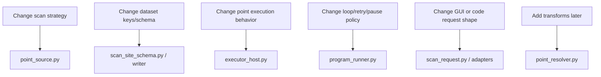
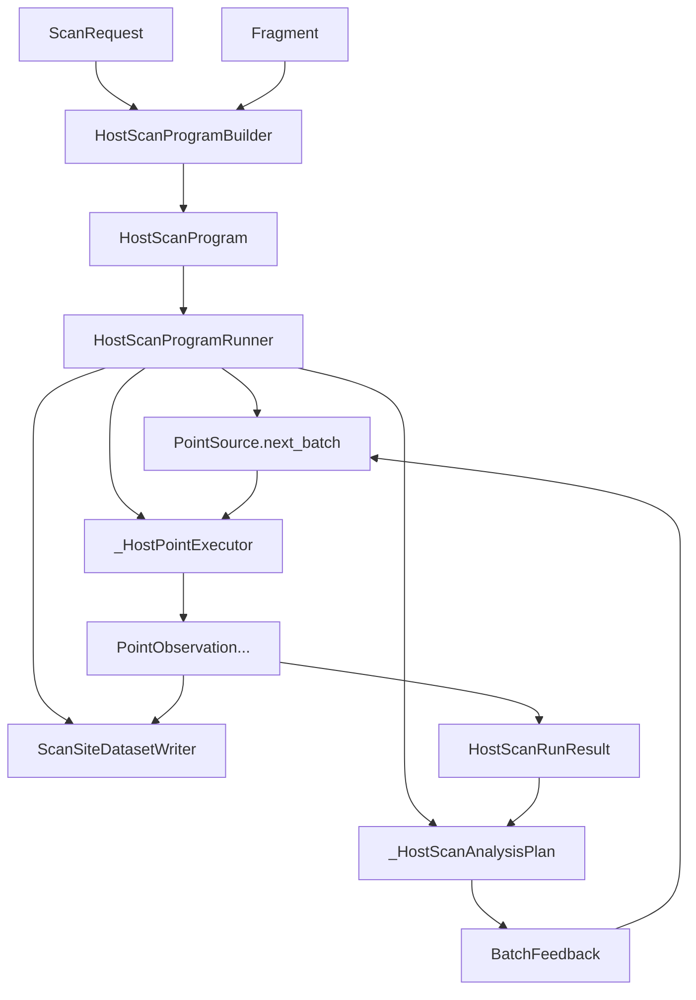
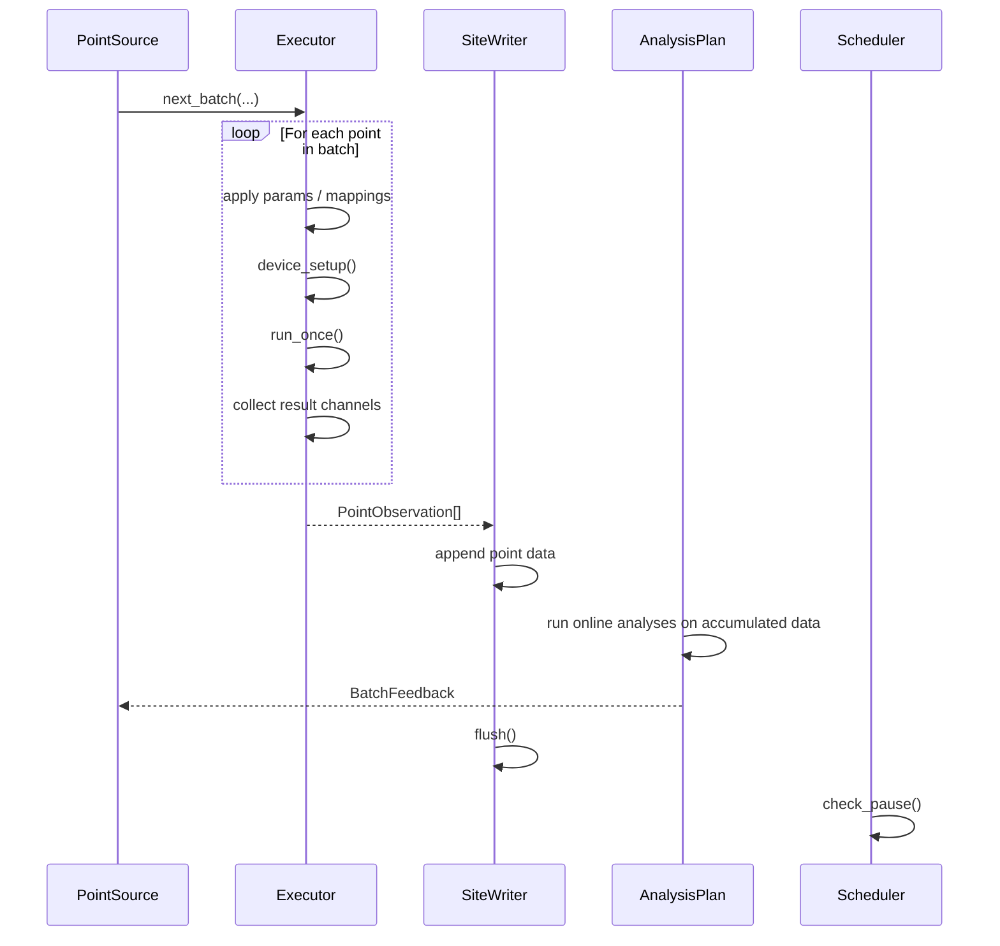

# Flexible Scans and Host-Only Runtime Rewrite Summary

This note is a condensed summary of the ambitions captured in
`implementation_inspiration.md`, with the additional conclusion that the most
practical path forward is a new host-only runtime written alongside the current
runtime rather than a flag-day rewrite.

## Why this exists

The `Fragment` authoring API in ndscan is strong and worth preserving.

The main pain point is the runtime side:

- `entry_point.py`
- `scan_runner.py`
- `subscan.py`

These currently mix together:

- fragment lifecycle
- point selection/composition
- host/kernel execution mechanics
- top-level/subscan differences
- dataset/schema writing
- analysis and UI-facing metadata

That makes the runtime hard to extend for new scan modes.

## Core ambitions

The long-term goal is to make ndscan better at describing and executing scans as
streams of points, rather than as a fixed Cartesian product of axes.

The main ambitions are:

1. Better point choice and point composition.
   - Keep standard grid scans (but flatten them).
   - Support zipped/tandem parameters natively.
   - Support explicit point lists.
   - Leave room for adaptive or optimizer-driven point selection.

2. One flat, append-only scan-site schema everywhere.
   - Use the same conceptual dataset layout for top-level scans and subscans.
   - Avoid ragged list-of-lists archival issues.
   - Keep `starts`-based segmentation for nested scan sites.

3. Live visibility while a scan is running.
   - Subscans should be visible live.
   - Preview/live data and canonical archive data should be explicit concepts.

4. Code-first runtime design.
   - The GUI should serialize into runtime concepts.
   - The GUI should not define the runtime architecture.
   - Launching from code and launching from the GUI should use the same core path.

5. Parameter following/transforms as a later, separate feature.
   - Parameter transforms are desirable.
   - They should be built on top of a cleaner point/runtime model.
   - They do not need to block the scan runtime work.

## What the current prototype work already shows

The current branch work is still useful as design inspiration.

It already demonstrates:

- append-only flat subscan datasets
- live data writes via teeing sinks
- `starts`-style segmentation
- the need for a dedicated scan-site dataset writer
- the value of treating ragged subscan data as a schema problem, not just a sink problem

What it does not yet provide is a clean runtime architecture for:

- pluggable point strategies
- unified top-level and subscan execution
- a code-first host-only engine
- later adaptive execution

## Architectural conclusion

The right move is not to keep stretching the current runtime design.

The right move is also not a destructive rewrite of everything at once.

The recommended path is:

1. Keep the fragment API largely intact.
2. Keep the existing kernel runtime path for legacy modes.
3. Build a new host-only runtime beside the existing runtime.
4. Route new flexible scan modes through the new runtime first.
5. Migrate existing host-side modes later if the design proves out.

This gives a realistic path to upstreamable PRs without forcing kernel concerns
to dominate the design.

## Delivery recommendation

If the goal is one final substantial PR rather than many intermediate PRs, the
scope needs to stay narrow and architectural.

Recommended shape of that PR:

- add a new host-only scan runner beside the legacy runtime
- add one canonical scan-site dataset schema/writer
- use the new path for host-side flexible scans and host-side subscans
- keep the legacy kernel path in place
- fail early for unsupported new-mode + kernel combinations

What should not be bundled into that same PR:

- parameter transforms / pseudoparameters
- adaptive optimizers
- broad dashboard redesign
- general cleanup that is unrelated to the new runtime
- a total replacement of all current runtime code

The first implementation should aim to be:

- simple
- maintainable
- code-first
- host-first
- explicit about non-goals

## What is worth specifying before implementation

The most important thing to lock down before coding is the scan-site dataset
layout, but it is not the only spec worth writing.

The recommended pre-implementation specs are:

1. Dataset / scan-site layout spec
2. Execution contract spec
3. Support matrix / non-goals spec

These should be short, concrete, and implementation-facing.

What is not worth over-specifying up front:

- pseudoparameter ontology
- adaptive optimizer APIs
- detailed GUI UX
- full kernel bridging

## Proposed host-only runtime model

The new runtime should be built around a small number of explicit concepts.

### 1. `ScanRequest`

External description of what the user wants to run.

- can come from code or GUI
- serializable
- still close to user-facing concepts

### 2. `ScanProgram`

Validated, fragment-bound runtime plan.

- resolved fragment/parameter handles
- chosen scan mode/strategy
- recorded/displayed axes
- scan-site metadata

### 3. `PointSource`

Object responsible for choosing the next point or batch of points.

Examples:

- grid
- zip
- explicit point list
- adaptive strategy later

This is the key abstraction missing from the current runtime.

### 4. `Executor`

Object responsible for executing resolved points against a fragment.

- apply point values to parameter stores
- run fragment lifecycle for the point
- collect result channels
- remain host-only at first

### 5. `ScanSiteDatasetWriter`

The only object that writes scan datasets.

Responsibilities:

- schema metadata
- `points.axis_*`
- `points.param_*`
- `points.channel_*`
- `starts`
- preview/live stream handling
- completed state

Top-level and subscan code should both use this.

### 6. `PointObservation`

Result of one completed point.

Could contain:

- point index
- axis values
- resolved parameter values
- channel values
- timestamps
- any parent-context identifiers needed by subscans

## Interface design principles

The runtime should be designed so that each concern has one owner.

The main rule is:

- planning modules do not write datasets
- writing modules do not choose points
- point-selection modules do not know about fragments
- fragment execution modules do not know dataset key layout
- adapters for top-level and subscan should be thin wrappers around the same core runtime

More concretely:

1. Only one place binds user intent to fragment handles.
   - Proposed owner: `program_builder.py`

2. Only one place chooses the next point or batch.
   - Proposed owner: `point_source.py`

3. Only one place runs the execution loop.
   - Proposed owner: `program_runner.py`

4. Only one place applies points to fragment stores and collects results.
   - Proposed owner: `executor_host.py`

5. Only one place knows dataset keys and schema serialization.
   - Proposed owner: `scan_site_schema.py` and `scan_site_dataset_writer.py`

6. Only one place adapts GUI/code requests into the runtime.
   - Proposed owners: thin adapters in `entry_point.py` and `subscan.py`

## Dependency rules

These rules are what make the system feel linear rather than tangled.

Allowed dependency direction:

```text
request -> builder -> runner -> executor -> observation -> writer
                        ^
                        |
                  point source
```

What should not happen:

- `PointSource` importing fragment execution code
- `Executor` importing dataset key logic
- `Writer` importing fragment/parameter internals
- `entry_point.py` and `subscan.py` each reimplementing their own execution loop
- plot/UI concerns leaking into runner internals

## Proposed module boundaries

The cleanest first split is likely:

### Core runtime modules

- `scan_request.py`
  - serializable request model from code/UI
- `program_builder.py`
  - bind `ScanRequest` to a concrete fragment tree
  - validate supported combinations
  - produce `ScanProgram`
- `point_source.py`
  - `PointSource`
  - grid/zip/point-list sources
- `point_resolver.py`
  - future hook for transforms/relations
  - identity resolver in PR 1
- `executor_host.py`
  - host-side point/batch execution
- `program_runner.py`
  - owns the main batch loop
  - coordinates point source, resolver, executor, writer
- `scan_site_schema.py`
  - typed metadata / naming / serialization rules
- `scan_site_dataset_writer.py`
  - only dataset IO layer

### Thin adapter modules

- `entry_point.py`
  - build request from dashboard args
  - call builder + runner
- `subscan.py`
  - build child-site request
  - call builder + runner

### Legacy compatibility modules

- existing kernel runner path
- existing classic runtime path, if needed during migration

## Recommended interface shapes

These are intentionally small and future-facing without adding too much
machinery to PR 1.

```python
@dataclass(frozen=True)
class ScanRequest:
    strategy: object
    axes: list[object]
    options: object
    site: object
```

```python
@dataclass(frozen=True)
class ScanProgram:
    fragment: object
    site: object
    point_source: "PointSource"
    recorder: object
    analysis_plan: object | None = None
    resolver: object | None = None
```

```python
@dataclass(frozen=True)
class BasePoint:
    index: int
    axis_values: tuple[object, ...]
```

```python
@dataclass(frozen=True)
class ResolvedPoint:
    index: int
    axis_values: tuple[object, ...]
    param_values: dict[str, object]
```

```python
@dataclass(frozen=True)
class PointObservation:
    point_index: int
    axis_values: tuple[object, ...]
    channel_values: dict[str, object]
    param_values: dict[str, object] | None = None
    acquired_at: float | None = None
```

Recommended rule for PR 1:

- `BasePoint` and `ResolvedPoint` can be almost identical
- the resolver can be the identity
- the interface still leaves a clean place for later transforms

## Mermaid: Interface Flow



## Mermaid: Change Locality



## Change-locality rules

If the design is working, these should be true:

1. To add a new scan strategy, you mostly touch `point_source.py` and maybe request parsing.
2. To change dataset layout, you mostly touch `scan_site_schema.py` and `scan_site_dataset_writer.py`.
3. To change execution semantics, you mostly touch `executor_host.py` or `program_runner.py`.
4. To add transforms later, you mostly touch `point_resolver.py`.
5. To change how top-level and subscan enter the system, you mostly touch the thin adapters.

If a change requires touching all of:

- request parsing
- execution
- dataset writing
- subscan adapter
- top-level adapter

then the boundary design is still wrong.

## Current Implementation Snapshot

The current host runtime has now moved beyond the early sketch above. The main
implemented flow is:



The batch boundary order is now explicit:



The most important schema-level consequence of recent work is that persisted point-like
data is now split by role:

- `points.pseudoparam_*` for runtime-only logical scan variables
- `points.param_*` for actual fragment parameters whose installed values changed
- `points.channel_*` for result channels

Repeated acquisition is also now a point-policy concern rather than a native axis:

- repeated points simply re-emit the same logical point
- no built-in repeat index is written
- if a repeat index is scientifically meaningful, it should be introduced explicitly as
  a `ScanVariable`

## Intended execution shape

The target mental model is:

```python
while not point_source.is_finished():
    batch = point_source.next_batch(batch_limit)
    observations = executor.execute_batch(fragment, batch)
    site_writer.append_points(observations)
    online_feedback = analysis.observe_batch(observations)
    point_source.observe_batch(online_feedback)
```

Later, if parameter transforms are added, they fit between point selection and
execution rather than being fused into UI code or subscan code.

## What this runtime rewrite is trying to remove

The rewrite should reduce or eliminate these current splits:

1. Top-level vs subscan runtime logic as separate worlds.
   - A subscan should be another scan site, not a different execution framework.

2. Scan mode vs dataset writing being tangled together.
   - Point choice should not imply a dataset layout special case.

3. Host execution logic vs planning logic being interleaved.
   - Planning and execution should be separate layers.

4. GUI schema parsing vs runtime semantics being coupled.
   - GUI input should feed a runtime model, not define it.

## Legacy ugly parts to quarantine

The current runtime has a few "shapes" that are understandable historically but
should not leak into the new core design.

These are the main ones to actively design against.

### 1. Top-level and subscan as different runtimes

Current feeling:

- top-level scans and subscans are conceptually similar
- but they are implemented through noticeably different code paths
- subscans also republish results as parent-owned aggregate channels

Why this is ugly:

- the same concept appears twice with different rules
- nested scans feel special rather than natural
- data layout and execution logic get tied together

What should replace it:

- every scan is a scan site
- a subscan is just a child scan site with a parent-point relationship
- top-level and subscan both enter the same `ScanProgram -> ProgramRunner ->
  ScanSiteDatasetWriter` pipeline

### 2. Scan/no-axes/time-series as special execution worlds

Current feeling:

- no-axes scans, time-series scans, and regular scans fork early
- they are not all expressed as point streams

Why this is ugly:

- it makes the runtime read like exceptions rather than one model
- every new scan mode risks creating another branch

What should replace it:

- "single run" = one empty point
- "time series" = a point source that emits points with a synthetic time axis
- "grid" and "zip" = just different point sources

The runtime loop should not care which of these produced the next point.

### 3. Dataset layout hidden in sink wiring

Current feeling:

- data layout decisions are spread across sink setup code
- subscan behavior is partly encoded by how channels are teed and buffered

Why this is ugly:

- the schema is implicit
- execution logic and persistence logic become inseparable
- changing dataset keys means spelunking through runtime code

What should replace it:

- a `ScanSiteDatasetWriter` that is the sole owner of dataset layout
- a `scan_site_schema.py` module that is the sole owner of naming and metadata

### 4. Array-valued result channels as the representation of subscans

Current feeling:

- subscans are surfaced as parent result channels containing arrays
- this made sense before canonical flat scan-site storage existed

Why this is ugly:

- a nested scan is not conceptually "just another result channel"
- it confuses execution with presentation/compatibility
- it encourages list-of-lists and opaque channel semantics

What should replace it:

- canonical representation: child scan site datasets
- compatibility representation: optional parent-facing exported channels/spec, if
  still needed for old consumers

Important design rule:

- parent aggregate array channels must not be the source of truth in the new path

### 5. Ad-hoc dict metadata assembled in multiple places

Current feeling:

- scan metadata is constructed in several places as loose dictionaries
- JSON/native conversion is repeated

Why this is ugly:

- schema drift is likely
- plot-side and offline tools must guess intent from keys

What should replace it:

- typed site metadata objects
- one serializer
- one parser
- one module that owns schema versioning

### 6. `HasEnvironment` shells owning too much logic

Current feeling:

- planning, schema assembly, and runtime semantics are mixed into ARTIQ-facing
  objects

Why this is ugly:

- logic becomes harder to test
- pure planning code becomes coupled to runtime side effects
- it is harder to see what is "core design" vs "ARTIQ shell glue"

What should replace it:

- keep `HasEnvironment` at the edges:
  - adapters
  - dataset writer
  - executor shell
- keep most planning logic in plain Python objects

### 7. One concept having multiple identifiers

Current feeling:

- parameters and channels are referred to by mixtures of:
  - FQN
  - fragment path
  - short display name
  - dataset key suffix

Why this is ugly:

- identity and presentation get mixed together
- naming bugs become hard to reason about

What should replace it:

- identity type for parameters: something like `(fqn, path)`
- identity type for channels: canonical path
- display names derived separately
- dataset key names derived in exactly one place

This point needs an even stronger rethink, because the current `FQN + path`
scheme is doing more than one job at once.

What it currently tries to do:

- identify a parameter schema/definition
- select one or more matching parameter instances
- help generate unique human-facing names

Those are three different concerns and should be separated.

### 7a. Proposed identity split

The cleanest model is:

1. Definition identity
   - "what parameter concept is this?"
   - example: fragment class FQN + local parameter name

2. Instance identity
   - "which concrete exposed parameter in this built fragment tree is this?"
   - example: canonical structural path from the scan root

3. Selector syntax
   - "how did the GUI / legacy API ask for this parameter?"
   - example: legacy `FQN + pathspec`

4. Presentation name
   - "what should the user see?"
   - human-readable label or derived display name

5. Dataset column key
   - "what machine-safe dataset field stores its values?"
   - should be collision-free and not depend on prettified names

### 7b. Proposed rule

`FQN + pathspec` should survive only as an adapter-level selector syntax for
legacy/dashboard compatibility.

It should not be the core identity used by the new runtime.

The new runtime should instead use structured instance references.

For example:

```python
@dataclass(frozen=True)
class FragmentPath:
    parts: tuple[str, ...]


@dataclass(frozen=True)
class ParamDefRef:
    fragment_fqn: str
    local_name: str


@dataclass(frozen=True)
class ParamRef:
    fragment_path: FragmentPath
    local_name: str
    definition: ParamDefRef
```

And similarly for channels and scan sites.

### 7c. How to avoid collisions without hashes

The key move is:

- do not try to encode full identities into shortened dataset key suffixes

Instead:

- use positional dataset keys like `axis_0`, `param_0`, `channel_0`
- store the full structured identity in metadata

That avoids collisions completely without hashes.

Suggested pattern:

```text
<site>points.axis_0
<site>points.param_0
<site>points.channel_0
```

with metadata such as:

```json
{
  "axes": [
    {
      "key": "axis_0",
      "param": {
        "fragment_path": ["laser"],
        "local_name": "detuning",
        "definition": {
          "fragment_fqn": "pkg.LaserFragment",
          "local_name": "detuning"
        }
      },
      "display_name": "Detuning"
    }
  ]
}
```

This gives:

- collision-free dataset keys
- stable machine-facing identity
- freedom to change display naming later
- freedom to keep legacy selectors only at the boundary

### 7d. Site naming without hashes

The same logic applies to scan-site identities.

Avoid:

- slugification
- slash-to-underscore replacement
- hash suffixes as the primary identity scheme

Prefer:

- canonical structural site paths
- root site plus child site paths derived from subscan ownership path

For example:

```text
ndscan.rid_<rid>.site.root.
ndscan.rid_<rid>.site.root.cooling_scan.
ndscan.rid_<rid>.site.root.cooling_scan.probe_scan.
```

This is only safe if the underlying path components are already guaranteed to be
non-colliding identifiers, which they generally are in the fragment tree.

If needed, the canonical identity should still be stored as structured metadata,
not reconstructed from prettified strings.

### 7e. Practical consequence

The new core should not need `shorten_to_unambiguous_suffixes(...)` for canonical
dataset writing.

If shortening is still used, it should be for presentation only.

### 8. Analysis living half in runtime and half in data consumers

Current feeling:

- analysis matching and result publication are interwoven with runtime code
- some analysis outputs are conceptually observations, some are metadata, some are
  bubbled channels

Why this is ugly:

- it makes the runner responsible for too much policy
- nested scan behavior gets harder to reason about

What should replace it:

- analysis should sit behind a narrow interface:
  - consume observations
  - emit annotations
  - emit bubbled scalar results if desired

The runner should coordinate analysis, not implement analysis-specific schema rules.

## Design laws for the new core

These should be treated as hard constraints, not soft preferences.

### Law 1: One canonical representation per concept

- one request model
- one program model
- one point model
- one observation model
- one site schema

No parallel representations unless one is explicitly an adapter.

### Law 2: Special cases must become strategies, not branches

If something can be expressed as a point source or a site option, do that rather
than creating another runtime loop.

### Law 3: Legacy compatibility must live in adapters only

If old ndscan concepts must remain visible, that is acceptable, but the new core
should not think in those terms.

Examples of legacy compatibility that should be adapters, not core:

- dashboard argument format
- parent aggregate array-valued subscan channels
- legacy top-level metadata key conventions, if retained

### Law 4: Side effects belong at the edges

The core runtime should mostly move plain data between pure-ish objects.

Side effects should be concentrated in:

- executor shell
- dataset writer
- top-level/subscan entry adapters

### Law 5: Nested scans are sites, not channels

This is one of the most important simplifications.

A child scan should always be thought of as:

- a nested site with its own canonical point stream
- indexed from its parent by `starts`

not as:

- a special result payload attached to the parent point

### Law 6: Identity is not presentation

- internal references should use stable identities
- display names should be derived later
- dataset key suffixes should be generated in one place
- collision-free positional keys are preferable to prettified unique-ish names

### Law 7: If a change touches many layers, the boundary is wrong

This is the practical test.

Adding `zip` should not require changing:

- dataset writing
- analysis plumbing
- top-level adapter
- subscan adapter
- executor internals

If it does, the system is still too entangled.

## Legacy adaptation boundary

A useful way to think about the old ndscan API is as an outer compatibility shell.

The new core should sit behind a narrow adaptation boundary:

```text
legacy/dashboard/code input
    -> request adapter
    -> ScanRequest
    -> ScanProgram
    -> ProgramRunner
    -> observations + canonical site datasets
```

The same should hold for subscans:

```text
legacy subscan API
    -> child request adapter
    -> child ScanProgram
    -> ProgramRunner
    -> child site datasets
    -> optional compatibility exports
```

This means the old API can survive for compatibility, while the new runtime
stays conceptually clean.

## "Just makes sense" sanity checks

Before settling on an interface, it should pass these tests:

1. Can I explain where a new scan mode goes in one sentence?
   - Desired answer: "in the point source / request parsing layer"

2. Can I explain where dataset naming changes go in one sentence?
   - Desired answer: "in the site schema/writer"

3. Can I explain what makes a subscan special in one sentence?
   - Desired answer: "only that it has a parent site and `starts` mapping"

4. Can I explain what the runner does without mentioning datasets?
   - Desired answer: yes

5. Can I explain what the writer does without mentioning fragments?
   - Desired answer: yes

6. Can I explain how transforms fit later without redesigning the loop?
   - Desired answer: yes, by inserting a resolver between point selection and execution

## Explicit non-goals for the first pass

To keep the work reviewable, the first pass should not try to solve everything.

Not in scope initially:

- full kernel-path redesign
- closed-loop adaptive kernel support
- first-class pseudo-parameter ontology
- a total rewrite of the fragment API
- a single huge PR that replaces all current runtime code

## Recommended staged plan

### A. Point engine + unified scan-site writer

Goal:

- decouple point choice from execution
- support `grid`, `zip`, and explicit point-list style execution
- unify flat/live dataset writing per scan site
- make subscan and top-level data layout converge

Likely outputs:

- `point_source.py`
- strategy helpers
- `scan_site_dataset_writer.py`
- a new host-only program runner

### B. Plotting and GUI integration

Goal:

- consume the flat/live scan-site schema cleanly
- allow live subscan viewing
- allow GUI submission of richer scan strategies

The UI should hook into the new runtime concepts, not invent parallel ones.

### C. Parameter transforms

Goal:

- add code-defined and possibly UI-defined parameter following/transforms
- keep this independent from the scan runtime rewrite

Examples:

- intensity -> compensated frequency
- AOM frequency -> compensated RF amplitude
- logical control parameters that map onto physical driven parameters

## Additional refactors that make this easier

These are high-value even without a full runtime migration:

1. Split subscan API from subscan runtime plumbing.
2. Split result channel ontology from sink implementations.
3. Centralize scan-site schema and key naming logic.
4. Move pure planning logic out of `HasEnvironment` classes where possible.
5. Mark legacy kernel-specific paths clearly and fail early for unsupported new modes.

## Recommended first implementation scope

If the goal is "best maintainable simple solution" rather than "maximum feature
coverage", the first implementation should likely include only:

1. canonical scan-site dataset schema
2. `ScanSiteDatasetWriter`
3. new host-only `ProgramScanRunner`
4. `grid` strategy
5. `zip` strategy
6. host-side subscan support through the same writer/schema
7. explicit `NotImplementedError` for unsupported kernel combinations

Nice-to-have but probably not required for the first pass:

- explicit point-list strategy
- top-level migration of all legacy host modes
- `points.param_*` recording for every possible parameter
- timestamps beyond a minimal acquired-at field

Probably too much for the first pass:

- transforms
- adaptive execution
- closed-loop kernel support
- major plotting redesign

## Spec workbook

The sections below are intended to be filled in before implementation. They
already include a proposed starting point so they can be edited rather than
written from scratch.

---

## Spec 1: Scan-Site Dataset Layout

### Why this spec matters

This is the most important spec to settle first because:

- top-level and subscan behavior should converge on one shape
- plot-side and offline tools will depend on it
- it determines what the writer owns
- it prevents runtime code from hard-coding dataset conventions in multiple places

### Fill in

- Final canonical root naming:
  - Proposed: `ndscan.rid_<rid>.site.root.` for top level
  - Proposed: `ndscan.rid_<rid>.site.<structural_site_path>.` for child sites
  - Decision needed: exact structural path encoding in the dataset namespace

- Preview/live root naming:
  - Proposed: `ndscan.rid_<rid>.preview.<structural_site_path>.`
  - Decision needed: whether preview is needed only for subscans or for all sites

- Required metadata keys:
  - Proposed: `ndscan_schema_revision`, `source_id`, `completed`,
    `fragment_fqn`, `axes`, `channels`, `mode`, `strategy`
  - Decision needed: whether `parameters` and `relations` are in scope for PR 1

- Required point arrays:
  - Proposed: `points.axis_*`, `points.channel_*`
  - Proposed optional: `points.param_*`, `points.acquired_at`
  - Decision needed: whether canonical channel/param keys should be positional
    (`channel_0`) rather than name-derived (`channel_result`)

- Segment keys:
  - Proposed: `starts`
  - Proposed optional later: `start_timestamps`

### Proposed draft

Canonical site root:

```text
Top level:
ndscan.rid_<rid>.site.root.

Child site:
ndscan.rid_<rid>.site.<structural_site_path>.
```

Preview root:

```text
ndscan.rid_<rid>.preview.<structural_site_path>.
```

Canonical per-site keys:

```text
<site>ndscan_schema_revision
<site>source_id
<site>completed
<site>fragment_fqn
<site>mode
<site>axes
<site>channels
<site>strategy

<site>points.axis_0
<site>points.axis_1
...
<site>points.channel_0
<site>points.channel_1

<site>starts
```

Optional keys for the first PR:

```text
<site>points.param_0
<site>points.acquired_at
```

Proposed invariants:

1. All canonical `points.*` arrays at one site have equal length.
2. `starts` is monotonic.
3. `starts[i]` corresponds to parent point index `i`.
4. Preview data is not the canonical/archive contract.
5. Flat data is the canonical/archive contract.
6. Subscan sites use the same conceptual schema as the top level.
7. Canonical dataset keys do not rely on shortened human-readable names.

Suggested simplification for PR 1:

- make flat layout canonical
- keep preview as a subscan-only convenience stream
- do not add more metadata than the writer and plot consumers actually need
- prefer positional point-array keys with metadata mapping over name-derived keys

Open questions to resolve:

- Do top-level runs also need a preview root, or is the canonical top-level stream
  already "live enough"?
- Should structural site paths be stored directly in the dataset hierarchy, or only in metadata?
- Are `mode` and `strategy` both needed in PR 1, or is one enough?
- Do we want canonical `channel_0`/`param_0` keys immediately, or only after a compatibility phase?

---

## Spec 2: Execution Contract

### Why this spec matters

This is what keeps the runner, point source, and dataset writer loosely coupled.

Without this, runtime code will slip back into one large mixed module.

### Fill in

- What a point source returns:
  - Proposed: batches of resolved axis/control values in runner-owned format
  - Decision needed: tuple-oriented vs dict-oriented point representation

- What an observation contains:
  - Proposed: point index, axis values, channel values, optional param values,
    optional timestamp
  - Decision needed: whether to include path/FQN-rich parameter identities or only
    structured refs that the writer serializes into metadata

- What the executor owns:
  - Proposed: applying values, running lifecycle, collecting results
  - Decision needed: whether retries live in the executor or in the runner

- What the writer expects:
  - Proposed: completed observations only
  - Decision needed: whether the writer ever sees partial points

### Proposed draft

Minimal conceptual interfaces:

```python
class PointSource(Protocol):
    def next_batch(self) -> list[object]: ...
    def observe(self, observation: "PointObservation") -> None: ...


@dataclass
class PointObservation:
    point_index: int
    axis_values: tuple[object, ...]
    channel_values: dict[object, object]
    param_values: dict[object, object] | None = None
    acquired_at: float | None = None
```

Proposed ownership split:

- `PointSource`
  - chooses points
  - may adapt based on `observe(...)`

- `ProgramScanRunner`
  - drives batch loop
  - coordinates retries/pause behavior
  - hands completed observations to the writer

- `Executor`
  - applies parameter values to stores
  - runs fragment lifecycle for the point
  - collects channel outputs

- `ScanSiteDatasetWriter`
  - never chooses points
  - never runs fragment code
  - only serializes and appends data

Recommended simplification for PR 1:

- use host-only execution
- make observations represent completed points only
- do not attempt partial-point writer updates
- keep the point representation simple even if not fully general yet

Likely initial representation choice:

- internal runner representation: ordered tuples for fast/easy compatibility with
  existing axis handling
- metadata/schema representation: structured refs with serialized metadata mappings

Open questions to resolve:

- Should `PointSource.next_batch()` return already-resolved points or only base
  points?
- Do retries belong inside the executor or at the runner layer?
- Should the writer receive axis values by index, by name, or both?
- Should observations use `ParamRef`/`ChannelRef` objects directly in memory?

---

## Spec 3: Support Matrix and Non-Goals

### Why this spec matters

This prevents scope creep and makes the PR easy to explain:

"Here is the new runner, here is where it applies, and here is where it does
not."

### Fill in

- Supported in PR 1:
  - Proposed: host-only `grid`, `zip`, host-side subscans
  - Decision needed: whether explicit point lists make the cut

- Explicitly unsupported in PR 1:
  - Proposed: new runtime on kernel paths, adaptive execution, transforms
  - Decision needed: exact error text and fallback behavior

- Legacy compatibility promise:
  - Proposed: existing kernel/grid path remains available unchanged
  - Decision needed: how much existing host path is migrated in PR 1

### Proposed draft

Support matrix:

| Capability | PR 1 status | Notes |
| --- | --- | --- |
| Host-side grid scans | Supported | Can use new runner |
| Host-side zipped scans | Supported | New capability |
| Host-side subscans | Supported | Should use same site writer/schema |
| Top-level legacy kernel scans | Supported via legacy path | Not migrated |
| New runtime on kernel path | Not supported | Raise explicit error |
| Adaptive/optimizer-driven scans | Not supported yet | Design left open |
| Parameter transforms | Not supported yet | Separate later work |
| Major GUI redesign | Not supported yet | GUI should only serialize minimal strategy state |

Recommended explicit non-goals text for PR 1:

- This change does not redesign the kernel execution path.
- This change does not add adaptive optimization.
- This change does not add parameter transform semantics.
- This change does not remove the legacy runner.

Recommended behavior for unsupported combinations:

- fail early during prepare/build if the request selects a new-runtime-only mode on
  a kernel execution path
- error text should state that the mode is host-only for now and that legacy grid
  kernel scans remain supported

---

## Bottom line

The fragment API is worth keeping.

The runtime architecture is the part that needs rethinking.

The most practical path is a new host-only runtime built around:

- `ScanRequest`
- `ScanProgram`
- `PointSource`
- `Executor`
- `ScanSiteDatasetWriter`
- `PointObservation`

This should coexist with the current kernel-oriented runtime until the new
design proves itself and the unsupported combinations are understood clearly.

Before implementation, the main thing to write down precisely is the
scan-site dataset layout, followed by the execution contract and the support
matrix. Those three specs should be enough to implement a clean first version
without over-designing the future.

## Full implementation plan

This section is the concrete implementation plan for the host-runtime refactor.
It is intended to be detailed enough that another engineer or agent could
implement it without making architectural decisions.

### Summary

Implement a new host-only runtime for ndscan from first principles, then make
host-side top-level scans and host-side subscans use it by default. Keep the
kernel path as an isolated legacy backend.

The new runtime will be built around five clean layers:

1. request/adapters
2. program building and binding
3. point sources
4. host execution
5. canonical scan-site dataset writing

The design goal is that each kind of change lands in one obvious place:

- new scan mode: point source layer
- new dataset shape: site schema/writer
- new execution behavior: executor/runner
- new input syntax: request adapters
- future transforms: resolver layer

This plan assumes a single final PR upstream, but internally it is built as a
sequence of local commits/phases with green tests after each phase.

### End-state decisions

These are locked decisions for the plan.

1. The refactor targets host-side top-level scans and host-side subscans as the end-state.
2. The kernel runtime remains in place as a legacy backend and is not redesigned in this refactor.
3. The new canonical runtime schema does not use `axis_*` as a first-class concept.
4. All driven variables are stored uniformly under canonical variable paths; plotting dimensions are declared in metadata.
5. Canonical dataset keys avoid hashes and avoid shortening logic by using structural paths, not human-shortened names.
6. `FQN + pathspec` remains only as a legacy/dashboard selector syntax at the adapter boundary; it is not the core identity model.
7. The new runtime is a clean break internally. Legacy surfaces may be adapted at the edges, but the new core will not think in legacy terms.
8. This refactor includes the minimum consumer updates required to read the new site schema for runtime usability, but does not include a broad dashboard UX redesign or transforms.

### Non-goals

These are explicitly out of scope.

1. Closed-loop adaptive execution.
2. Parameter transforms / pseudoparameters.
3. Full kernel/backend unification.
4. Broad GUI redesign for new scan modes.
5. Preserving old aggregate subscan channel payloads as canonical truth.
6. Keeping `shorten_to_unambiguous_suffixes(...)` in the new canonical write path.

### Core architecture

#### Runtime concepts

The new runtime uses these types and nothing more at its core.

1. `FragmentPath`
   - Tuple of structural fragment-path components from the runtime root.

2. `ParamDefRef`
   - Definition identity.
   - `fragment_fqn + local_name`.

3. `ParamRef`
   - Concrete exposed parameter identity in a built fragment tree.
   - `fragment_path + local_name + ParamDefRef`.

4. `ChannelRef`
   - Concrete result channel identity in a built fragment tree.
   - `fragment_path + local_name`.

5. `SiteRef`
   - Canonical nested scan-site identity.
   - Structural site path from root, no hashes.

6. `ScanRequest`
   - User-facing or adapter-facing request.
   - Serializable.
   - Does not contain `ParamStore`s or runtime objects.

7. `ScanProgram`
   - Bound runtime plan.
   - Contains bound parameter/channel refs, store bindings, point source, resolver, writer metadata, and analysis bridge.

8. `BasePoint`
   - Point emitted by a point source.
   - Mapping of `ParamRef -> value`.

9. `ResolvedPoint`
   - Output of resolver.
   - In this refactor the resolver is identity, but the type exists now so transforms can slot in later without redesign.

10. `PointObservation`
   - Completed point.
   - Contains point index, resolved variable values, result channel values, optional timestamp.

#### Layer ownership

1. `scan_request.py`
   - Request model and request-side helpers.
   - No fragment execution.
   - No dataset writing.

2. `program_builder.py`
   - Bind `ScanRequest` to a fragment tree.
   - Resolve selectors to `ParamRef`s.
   - Validate supported combinations.
   - Build `ScanProgram`.

3. `point_sources.py`
   - All point-choice logic.
   - `single`, `grid`, `zip`, later `point_list`.
   - No fragment or dataset imports.

4. `point_resolver.py`
   - `resolve(base_point) -> resolved_point`.
   - Identity implementation in PR 1.

5. `host_executor.py`
   - Apply resolved values to stores.
   - Execute fragment lifecycle and result collection.
   - No dataset key logic.

6. `program_runner.py`
   - Orchestrate pause/chunk lifecycle, batch iteration, resolver, executor, analysis bridge, writer.

7. `scan_site_schema.py`
   - Canonical metadata dataclasses.
   - Dataset key construction.
   - Serialization and parsing.

8. `scan_site_dataset_writer.py`
   - Only dataset-writing layer.
   - Writes metadata, points, starts, preview.
   - No fragment internals.

9. Adapter shells:
   - `entry_point.py`
   - `subscan.py`
   - These convert legacy/dashboard/code inputs into `ScanRequest` and invoke the new runtime.

#### Dependency direction

Allowed direction:

`request -> builder -> runner -> resolver -> executor -> observation -> writer`

Point sources plug into the runner.

Not allowed:

1. Point sources importing fragment execution code.
2. Executor importing dataset schema/key logic.
3. Writer importing fragment internals.
4. `entry_point.py` and `subscan.py` each inventing their own execution loop.
5. Plot/UI rules leaking into the runtime core.

### Canonical site schema

#### Root naming

Use structural site paths, not hashes.

Canonical roots:

- top-level site:
  - `ndscan.rid_<rid>.site.root.`
- child site:
  - `ndscan.rid_<rid>.site.<site_path>.`

Preview roots:

- preview stream:
  - `ndscan.rid_<rid>.preview.<site_path>.`

`<site_path>` is the structural subscan path from root, encoded as dataset namespace segments. In PR 1, path components must already be valid identifier-like names; if not, the builder raises a clear error rather than inventing a shortening/hash scheme.

#### Canonical metadata keys

Each site writes:

- `ndscan_schema_revision`
- `source_id`
- `completed`
- `fragment_fqn`
- `site_path`
- `mode`
- `strategy`
- `variables`
- `channels`
- `display_dimensions`
- `starts`

Optional in this refactor if easy:

- `acquired_at_present`
- `analysis`
- `annotations`

#### Canonical point arrays

No `axis_*`.

Use structural paths.

Examples:

- `points.var.cooling.detuning`
- `points.var.cooling.intensity`
- `points.channel.readout.counts`
- `points.channel.fit.center`

Preview uses the same shape, but under `preview.<site_path>.`.

#### Variable metadata shape

Each entry in `variables` includes:

- `path`
- `definition`
- `display_name`
- `kind`
  - `controlled`
  - `recorded_only`
  - `derived` reserved for later
- `display_dimension`
  - boolean
- `dataset_key`
  - canonical point-array key suffix, for example `points.var.cooling.detuning`

#### Channel metadata shape

Each entry in `channels` includes:

- `path`
- `display_name`
- `type`
- `unit`
- `dataset_key`

#### Invariants

1. All canonical point arrays at a site have equal length.
2. `starts` is monotonic.
3. `starts[i]` maps to parent point index `i`.
4. Preview is not canonical truth.
5. Flat site data is canonical truth.
6. Canonical keys do not rely on shortening or collision-prone munging.
7. Plot dimensions are declared in metadata, not inferred from `axis_*`.

### Public APIs and interface changes

#### New internal/public-facing runtime types

Add under `ndscan/experiment/`:

- `runtime_refs.py`
- `scan_request.py`
- `scan_program.py`
- `point_sources.py`
- `point_resolver.py`
- `host_executor.py`
- `program_runner.py`
- `scan_site_schema.py`
- `scan_site_dataset_writer.py`
- `analysis_bridge.py`

#### Existing API behavior after cutover

1. `make_fragment_scan_exp(...)`
   - host-side path uses the new runtime
   - kernel path keeps using the legacy kernel runtime

2. `SubscanExpFragment`
   - host-side path uses the new runtime for nested sites
   - kernel path remains legacy

3. `setattr_subscan(...)`
   - becomes a compatibility adapter
   - builds a child `ScanRequest` / `ScanProgram`
   - may materialize legacy-style return values for old callers if required locally
   - canonical truth remains child site datasets

4. Legacy dashboard parameter payload
   - supported only through a request adapter
   - selector resolution from `FQN + pathspec` to `ParamRef`s happens in `program_builder.py`
   - pathspecs do not appear below the builder layer

#### Important interface definitions

These are the exact shapes to implement.

##### `runtime_refs.py`

```python
@dataclass(frozen=True)
class FragmentPath:
    parts: tuple[str, ...]

@dataclass(frozen=True)
class ParamDefRef:
    fragment_fqn: str
    local_name: str

@dataclass(frozen=True)
class ParamRef:
    fragment_path: FragmentPath
    local_name: str
    definition: ParamDefRef

@dataclass(frozen=True)
class ChannelRef:
    fragment_path: FragmentPath
    local_name: str

@dataclass(frozen=True)
class SiteRef:
    parts: tuple[str, ...]
```

##### `scan_request.py`

```python
@dataclass(frozen=True)
class RequestedVariable:
    target: object  # selector-level ref only
    values: object  # strategy-specific spec

@dataclass(frozen=True)
class StrategySpec:
    kind: Literal["single", "grid", "zip", "point_list"]
    payload: dict[str, Any]

@dataclass(frozen=True)
class ScanRequest:
    site: SiteRef
    strategy: StrategySpec
    driven_variables: list[RequestedVariable]
    recorded_variables: list[object]
    display_dimensions: list[object]
    preview_enabled: bool
    options: ScanOptions
```

##### `scan_program.py`

```python
@dataclass(frozen=True)
class BoundVariable:
    ref: ParamRef
    store: ParamStore
    display_dimension: bool

@dataclass(frozen=True)
class ScanProgram:
    fragment: ExpFragment
    site: SiteRef
    strategy: StrategySpec
    driven_variables: list[BoundVariable]
    recorded_variables: list[BoundVariable]
    channels: list[ChannelRef]
    point_source: PointSource
    resolver: PointResolver
    analysis_bridge: AnalysisBridge | None
```

##### `point_sources.py`

```python
@dataclass(frozen=True)
class BasePoint:
    index: int
    values: dict[ParamRef, Any]

class PointSource(Protocol):
    def next_batch(self, max_points: int) -> list[BasePoint]: ...
    def observe(self, observation: PointObservation) -> None: ...
    def reset(self) -> None: ...
```

Required implementations:

- `SinglePointSource`
- `GridPointSource`
- `ZipPointSource`
- `PointListSource` may be added at the end of the refactor if still small; it is not required for the first cutover

##### `point_resolver.py`

```python
@dataclass(frozen=True)
class ResolvedPoint:
    index: int
    values: dict[ParamRef, Any]

class PointResolver(Protocol):
    def resolve_batch(self, points: list[BasePoint]) -> list[ResolvedPoint]: ...
```

Initial implementation:

- `IdentityResolver`

##### `host_executor.py`

```python
@dataclass(frozen=True)
class PointObservation:
    point_index: int
    variable_values: dict[ParamRef, Any]
    channel_values: dict[ChannelRef, Any]
    acquired_at: float | None = None

class HostExecutor:
    def execute_batch(
        self,
        fragment: ExpFragment,
        points: list[ResolvedPoint],
    ) -> list[PointObservation]: ...
```

Executor responsibilities:

- set stores
- call `device_setup()`
- call `run_once()`
- collect result channels
- preserve current host-side cleanup semantics
- no dataset writing

##### `scan_site_schema.py`

Typed schema dataclasses:

- `VariableMeta`
- `ChannelMeta`
- `SiteMeta`

Plus:

- dataset key constructors from `SiteRef`, `ParamRef`, `ChannelRef`
- JSON/native scalar serialization helpers
- parser helpers for consumers

##### `scan_site_dataset_writer.py`

```python
class ScanSiteDatasetWriter:
    def begin_site(self, meta: SiteMeta) -> None: ...
    def begin_segment(self, parent_point_index: int) -> None: ...
    def append_observation(self, observation: PointObservation) -> None: ...
    def finish_site(self) -> None: ...
    def reset_preview(self) -> None: ...
```

Writer responsibilities:

- metadata
- canonical point arrays
- starts
- preview stream
- completed flag

No execution logic.

### Analysis integration

Do not redesign analysis semantics in this refactor.

Implement `analysis_bridge.py` as a narrow bridge that adapts the existing default-analysis system to the new runtime.

#### Decision

1. Analysis remains post-run for the first cutover.
2. The runner accumulates in-memory observations for the current site.
3. At site completion, `AnalysisBridge` reconstructs the data shape expected by the existing analysis code.
4. Analysis outputs are then written via the site writer as metadata and optional bubbled scalar channels.
5. The runner does not embed analysis-specific dataset-key rules.

This keeps the runtime clean while avoiding a second analysis redesign in the same PR.

### Simplest-to-richest build sequence

This is the implementation order. Each phase ends with passing tests and a stable commit. No phase may introduce a workaround that the next phase has to undo.

#### Phase 0: Lock the specs in code comments and tests

Files:

- new schema/type modules with docstrings only
- no behavior changes yet

Work:

1. Create the new modules with empty/draft types and docstrings.
2. Add unit tests that codify the chosen naming and identity rules.
3. Add tests for structural site paths and variable/channel key construction.

Purpose:

- force the identity and schema decisions before execution code exists

Tests:

- `ParamRef` equality/hash behavior
- structural site path serialization
- no shortening/hashing in canonical keys
- invalid non-identifier path component error text

#### Phase 1: Implement runtime refs and schema layer

Files:

- `runtime_refs.py`
- `scan_site_schema.py`

Work:

1. Implement the structured identity types.
2. Implement metadata dataclasses and serializers.
3. Implement canonical dataset key constructors:
   - `site root`
   - `points.var.<path>`
   - `points.channel.<path>`
4. Add parser helpers for consumers.

Rules:

- no `FQN + pathspec` below this layer
- no `axis_*`
- no shortening logic

Tests:

- roundtrip serialization/parsing
- identical definition refs with different instance refs remain distinct
- two different structural paths never collide in canonical dataset keys

#### Phase 2: Implement request and builder layers

Files:

- `scan_request.py`
- `program_builder.py`

Work:

1. Define `ScanRequest`, `StrategySpec`, `RequestedVariable`, `BoundVariable`.
2. Implement builder that:
   - walks the fragment tree
   - creates `ParamRef`s and `ChannelRef`s
   - binds driven variables to stores
   - validates display dimensions
   - produces `ScanProgram`
3. Implement legacy selector adapter:
   - consume old `FQN + pathspec`
   - resolve to concrete `ParamRef`s
   - error if ambiguous or unmatched

Rules:

- pathspec resolution lives only here
- builder is the only place that turns selectors into concrete runtime refs

Tests:

- request binding for top-level params
- request binding for nested params
- unmatched selector errors
- ambiguous selector errors
- display dimension must refer to a driven variable
- recorded variables may include driven variables and extra variables

#### Phase 3: Implement the smallest executable host runtime

Files:

- `point_sources.py`
- `point_resolver.py`
- `host_executor.py`
- `program_runner.py`

Work:

1. Implement `SinglePointSource`.
2. Implement `IdentityResolver`.
3. Implement `HostExecutor` for a batch of resolved points.
4. Implement `ProgramRunner` with the simplest batch loop:
   - no scheduler/pause yet
   - no subscans yet
   - just run a site to completion
5. Collect result channels through a result-batcher-like mechanism local to the executor.

Rules:

- executor writes nothing
- runner writes nothing directly
- writer gets only completed observations

Tests:

- single-point host fragment execution
- missing result push error
- per-point variable application
- observation contents are correct

#### Phase 4: Implement the writer and canonical top-level host runtime

Files:

- `scan_site_dataset_writer.py`
- `entry_point.py`

Work:

1. Implement writer for top-level canonical site datasets.
2. Integrate `ProgramRunner` + writer into host-side top-level execution.
3. Represent "no-axes single" as `SinglePointSource`.
4. Represent time series as a point source emitting a synthetic time variable.
5. Replace host-side direct dataset writing in `TopLevelRunner` with writer usage.

Rules:

- top-level host runtime now uses the same site schema as planned for subscans
- metadata is emitted once through the schema layer
- no ad-hoc metadata dict assembly in `entry_point.py`

Tests:

- host single-point top-level datasets
- host grid top-level datasets
- time-series datasets with synthetic time variable
- metadata contains `display_dimensions`, not `axes`
- canonical variable keys use structural paths

#### Phase 5: Add grid point source and cut host top-level scans over

Files:

- `point_sources.py`
- `entry_point.py`

Work:

1. Implement `GridPointSource`.
2. Add request parsing for `grid`.
3. Make host-side `make_fragment_scan_exp(...)` use the new runtime by default.
4. Keep kernel selection on the legacy backend.

Rules:

- current host-side grid behavior must remain semantically equivalent, but datasets follow the new canonical schema
- kernel code path untouched except for selection

Tests:

- existing host-side grid scan parity against expected results
- host-only default analyses still execute through the bridge
- kernel fragments still use legacy path
- new runtime on kernel-only modes errors early

#### Phase 6: Integrate subscans as nested sites

Files:

- `subscan.py`
- `program_runner.py`
- `scan_site_dataset_writer.py`

Work:

1. Make host-side subscans build child `ScanRequest`s and `ScanProgram`s.
2. Give each child site a structural `SiteRef` derived from subscan ownership path.
3. Begin a child segment with the parent point index before running the child.
4. Write child observations to the child site root.
5. Remove canonical dependence on parent aggregate array-valued channels.

Rules:

- nested scan truth is the child site, not a parent result payload
- `starts` is the parent/child mapping
- top-level and subscan use the same writer and runner

Compatibility:

- `setattr_subscan(...)` may still return legacy-style arrays to callers after completion if needed, but this is a wrapper concern only

Tests:

- nested subscan writes a child site
- repeated invocation of the same subscan appends new segments to the same child site
- `starts[i]` maps correctly to parent point `i`
- top-level and child site schemas are structurally identical
- no list-of-lists in canonical storage

#### Phase 7: Add zip strategy

Files:

- `point_sources.py`
- `scan_request.py`
- `program_builder.py`

Work:

1. Implement `ZipPointSource`.
2. Add request validation for `zip`.
3. Ensure display dimensions can be chosen independently of strategy shape.
4. Ensure canonical variable storage remains unchanged.

Rules:

- strategy only affects emitted points
- strategy does not affect dataset shape

Tests:

- zipped two-variable scan pairs correctly
- mismatched lengths raise clear validation errors
- plot dimensions metadata remains correct
- canonical dataset keys unchanged

#### Phase 8: Analysis bridge and consumer updates

Files:

- `analysis_bridge.py`
- `plots/model/subscriber.py`
- `plots/model/subscan.py`
- `results/tools.py`
- `show.py`

Work:

1. Finalize the post-run analysis bridge.
2. Emit annotations and bubbled scalar results through canonical metadata/channels.
3. Update live/offline consumers to parse:
   - `display_dimensions`
   - `variables`
   - canonical `points.var.*`
   - child sites by structural site path
4. Keep consumer behavior thin: parse schema first, then operate on canonical paths.

Rules:

- consumers do not guess structure from old `axis_*`
- schema parsing is centralized

Tests:

- top-level plot subscriber can load new host runtime datasets
- nested subscan model resolves child site correctly
- offline tool can inspect variables/channels by structured path
- annotations survive roundtrip

#### Phase 9: Cutover cleanup and legacy isolation

Files:

- `scan_runner.py`
- `entry_point.py`
- `subscan.py`
- runtime modules

Work:

1. Remove unused host-side logic from legacy runner code paths.
2. Leave only:
   - legacy kernel runtime
   - optional legacy compatibility wrappers
3. Add large module-level docstrings marking legacy kernel path as legacy and host runtime as canonical.
4. Ensure host runtime is the only path new scan modes use.

Rules:

- do not leave two active host execution loops in the codebase
- keep the legacy kernel backend isolated and clearly named

Tests:

- no host-only path accidentally routes through legacy runner
- kernel path still passes legacy tests
- unsupported new-mode + kernel combinations fail with explicit error messages

### File-by-file change plan

#### New files

1. `ndscan/experiment/runtime_refs.py`
2. `ndscan/experiment/scan_request.py`
3. `ndscan/experiment/program_builder.py`
4. `ndscan/experiment/scan_program.py`
5. `ndscan/experiment/point_sources.py`
6. `ndscan/experiment/point_resolver.py`
7. `ndscan/experiment/host_executor.py`
8. `ndscan/experiment/program_runner.py`
9. `ndscan/experiment/scan_site_schema.py`
10. `ndscan/experiment/scan_site_dataset_writer.py`
11. `ndscan/experiment/analysis_bridge.py`

#### Existing files to edit

1. `ndscan/experiment/entry_point.py`
   - reduce to adapter + host/kernel selector
2. `ndscan/experiment/subscan.py`
   - reduce to subscan adapter + compatibility wrapper
3. `ndscan/experiment/scan_runner.py`
   - legacy kernel-only logic or extracted legacy wrapper
4. `ndscan/experiment/result_channels.py`
   - keep sink/channel ontology only
   - remove canonical dataset-shape responsibilities
5. `ndscan/plots/model/subscriber.py`
6. `ndscan/plots/model/subscan.py`
7. `ndscan/results/tools.py`
8. `ndscan/show.py`

### Test plan

#### New unit tests

1. `test_experiment_runtime_refs.py`
   - ref equality
   - hashing
   - serialization
   - collision-free canonical path mapping

2. `test_experiment_scan_site_schema.py`
   - site root naming
   - variable/channel metadata serialization
   - invalid path component failures

3. `test_experiment_program_builder.py`
   - request binding
   - legacy selector resolution
   - ambiguous/unmatched selector errors
   - display-dimension validation

4. `test_experiment_point_sources.py`
   - single
   - grid
   - zip
   - mismatched zip lengths

5. `test_experiment_host_executor.py`
   - per-point variable application
   - missing result errors
   - observation correctness

6. `test_experiment_program_runner.py`
   - batch orchestration
   - identity resolver flow
   - analysis bridge invocation
   - early failure on unsupported host/kernel combinations

7. `test_experiment_scan_site_dataset_writer.py`
   - metadata emission
   - point append behavior
   - starts semantics
   - preview reset behavior

#### Existing test suites to update

1. top-level host scan tests
2. subscan tests
3. default analysis tests
4. plot subscriber/subscan tests
5. offline results tests

#### Mandatory acceptance scenarios

1. Single host-side scan with one driven variable writes canonical site datasets.
2. Host-side grid scan writes canonical variable/channel arrays without `axis_*`.
3. Host-side time-series scan writes a synthetic time variable and is otherwise the same runtime.
4. Host-side subscan writes a child site with correct `starts`.
5. Same subscan invoked multiple times reuses site identity and appends segments.
6. Zip scan pairs variables correctly.
7. Existing kernel scans still work via the legacy path.
8. New runtime features on kernel paths fail explicitly and early.
9. Canonical dataset keys contain no hashes and no suffix-shortening logic.
10. Plot/offline consumers can read the new host runtime schema.

### Internal commit sequence for the single final PR

Use one upstream PR, but build it locally in this commit order:

1. refs + schema types
2. request + builder
3. smallest host executor/runner
4. writer + top-level single-point
5. grid top-level cutover
6. subscan nested-site integration
7. zip strategy
8. analysis bridge + consumer updates
9. host cutover cleanup + legacy isolation

Each commit must leave tests green.

### Acceptance criteria

The refactor is complete when all of these are true:

1. Host-side top-level and host-side subscan execution use the new runtime.
2. Kernel runtime still works through the legacy backend.
3. The new runtime has one canonical site schema and one writer.
4. The new runtime has no `axis_*` concept in canonical storage.
5. Structural paths, not hashes or shortened suffixes, define canonical dataset keys.
6. `FQN + pathspec` exists only in request adapters.
7. A new scan strategy can be added without touching dataset writing or executor logic.
8. A dataset-layout change can be made without touching point-source or executor logic.
9. The resulting codebase has one host runtime, not two.

### Assumptions and defaults chosen

1. Canonical site datasets use structural path keys like `points.var.cooling.detuning`, not `axis_*` or shortened names.
2. Structural path components are assumed to be identifier-safe in PR 1; invalid components cause explicit builder errors.
3. Preview roots are supported for nested sites; top-level preview is not required in PR 1.
4. `PointListSource` is optional and may be deferred to the end if it threatens the cutover timeline.
5. Analysis remains post-run through a bridge rather than being redesigned as a streaming observer system in this refactor.
6. Legacy `setattr_subscan(...)` may remain as a wrapper, but canonical truth is always nested site datasets.
7. Minimal consumer updates are included so the new runtime is actually usable; broad dashboard UX changes remain out of scope.

### Next priorities after the current host-runtime milestone

The new host runtime now has:

- code-first point sources,
- recursive nested scan sites,
- canonical scan-site writing,
- post-run default analyses.

The main missing work is no longer "invent the runtime". It is "make it the real path"
and then add the next layer of scanning behavior.

#### Priority 1: reader/consumer updates for the new scan-site schema

Why first:

- the new runtime is much more valuable once plot/offline tools can consume it,
- this is the main usability gap after the core runtime landed,
- it will test whether the schema is actually pleasant for non-ARTIQ code.

Scope:

- live subscriber model for the new site schema,
- HDF5 reader for the new site schema,
- nested site discovery via `site.path` / `site.parent_path`,
- segment reconstruction via `segments.start_index` / `segments.parent_point_index`.

#### Priority 2: adapters from existing host-side entry points into the new runtime

Why second:

- the runtime is most useful once ordinary ndscan experiment submission can reach it,
- this isolates legacy compatibility at the edges rather than in the core.

Scope:

- host-side top-level adapter from dashboard/legacy request syntax into `ScanRequest`,
- host-side subscan adapter so legacy `setattr_subscan(...)` can target the new core,
- explicit early errors for unsupported kernel-only combinations.

#### Priority 3: timestamp support and explicit scheduler/yield boundaries

Why third:

- this improves both live introspection and later batching work,
- it is orthogonal to point-policy complexity.

Scope:

- record a Unix timestamp at the start of each segmented site execution,
- optionally record per-point acquisition timestamps,
- make scheduler pause/yield boundaries explicit and testable,
- define whether batching/flush boundaries coincide with those same checkpoints.

Recommended shape:

- `segments.start_unix_time`
- optional `points.acquired_at_unix`

#### Priority 4: richer point-policy composition

Why here:

- the simple runtime core is already in place,
- more advanced scan behavior should live in point-policy code, not in the runner.

Scope:

- recursive min/max refinement scans,
- composable point-policy algebra such as product/sum/zip/concatenate,
- point-policy metadata that explains the chosen structure to readers.

Design note:

- early-exit logic should live with point-policy state or point-policy wrappers, not be
  spread through the runner.

#### Priority 5: early-exit / repeat-until conditions

Why separate from point generation:

- semantically this is not just "which point comes next";
  it is also "should this site or segment stop now".

Scope:

- stop current segment once a threshold/criterion is met,
- proceed to the next configured segment or experiment step,
- make the stop reason observable in metadata if useful.

Likely shape:

- a wrapper point policy or execution policy around an existing source,
- optional `state.stop_reason` if that turns out to be useful.

#### Priority 6: online analyses and closed-loop optimisation feedback

Why after the above:

- this is the first feature that genuinely needs observation callbacks, batching, and a
  stable flush interface all at once.

Scope:

- online analysis observer interface,
- closed-loop ask/tell optimiser interface,
- batching/flush policy so analysis updates do not churn the dataset layer,
- initial simple optimiser such as gradient descent over a parameter set.

Important separation:

- online analysis publication is not the same concern as optimiser feedback,
- but they should share observation and batching infrastructure.

#### Priority 7: parameter transform / relation API

Why later:

- it is important, but it changes fragment semantics rather than just scan execution,
- it wants a careful fragment-side API and validation story.

Scope:

- bind one parameter as a transform of others,
- code-defined transforms first,
- optional UI formula transforms later,
- runtime hook before `run_once()` so resolved values are visible everywhere.

#### Priority 8: mid-run HDF5 preview writing

Why later:

- once schema readers and batching exist, this becomes much easier to design cleanly,
- the runtime should not grow ad-hoc file-writing logic too early.

Scope:

- periodic/snapshot HDF5 writing for ongoing scans,
- or a dataset-to-HDF5 mirror driven by the same writer flush boundaries.

Recommended direction:

- do not make the runner itself "an HDF5 writer",
- instead let `ScanSiteDatasetWriter.flush()` become the single place where a future
  HDF5 mirror or preview exporter hooks in.

#### Features discussed elsewhere that are easy to forget

These have come up in the design notes and should remain visible:

1. Host-side legacy subscan cutover onto the new runtime is still not done.
2. Dashboard/request parsing into `ScanRequest` is still not done.
3. Minimal consumer updates for the new site schema are still not done.
4. Optional preview roots are still a policy question, not a settled implementation.
5. `points.param_*` recording has been discussed, but is not currently essential.
6. The canonical contract should stay HDF5 + JSON, not PYON-dependent.
7. Unsupported host/kernel combinations should fail early with clear messages.

#### Suggested priority order

1. Consumer/read-side support for the new scan-site schema.
2. Host-side legacy adapters into the new runtime.
3. Timestamp fields and explicit scheduler/yield boundaries.
4. Richer point-policy composition.
5. Early-exit / repeat-until conditions.
6. Online analysis + optimiser feedback + batching.
7. Parameter transforms / relations.
8. Mid-run HDF5 preview/snapshot writing.

### Pragmatic implementation plan from the current state

The list above is the broad project view. For actual implementation momentum, there is
an important distinction:

- if the goal is "make the runtime and future plotting direction right",
- and not immediately "land a polished upstream PR with consumer compatibility",

then the next steps should stay focused on the runtime core.

That means the consumer/read-side and legacy adapter work should be treated as:

- important for eventual integration,
- but not the first thing to do if the live plotting/frontend path is likely to be
  rewritten anyway.

#### Phase 1: strengthen the runtime core

These are the next changes that most improve capability without forcing us to commit to
legacy consumer interfaces too early.

1. Add scan/segment timestamps.
   - `segments.start_unix_time`
   - optional `points.acquired_at_unix`
   - define exactly when timestamps are taken
   - add tests for root and nested segmented sites

2. Make scheduler/yield boundaries explicit and testable.
   - isolate the policy for `check_pause()` and `pause()`
   - add tests that we only yield at point-safe boundaries
   - decide whether future batching flushes must align with the same boundaries

3. Add richer point-policy composition.
   - recursive interval refinement / min-max-to-depth scans
   - compositional wrappers such as `zip`, `product`, `concat`, possibly `repeat`
   - keep all of this in the point-policy layer, not the runner

4. Add early-exit / repeat-until wrappers.
   - stop current segment when a threshold or criterion is met
   - continue to the next planned segment / parent point / experiment step
   - keep this as a point-policy or execution-policy wrapper

This phase should leave the runtime better at "running interesting scans" without
changing the schema much beyond timestamps.

#### Phase 2: add observation-driven runtime features

Once point policies and timestamps are in place, add the first genuinely feedback-driven
features.

1. Introduce an observation/batching interface.
   - explicit observer API
   - runtime-controlled flush cadence
   - no fragment-side batching logic

2. Add online analyses.
   - use the observation path
   - publish updates in a throttled way
   - keep post-run default analysis as the final/full analysis path

3. Add a first closed-loop optimiser backend.
   - simplest candidate: gradient descent over a small set of parameters
   - later ask/tell optimiser interface if needed

This phase is where the existing `flush()` / `close()` hook on the site writer becomes
useful instead of merely preparatory.

#### Phase 3: fragment-side semantic extensions

Only after the runtime loop and observation path are stable:

1. Add parameter transform / relation API.
   - code-defined first
   - explicit conflict semantics
   - resolved before `run_once()`

2. Decide whether transformed parameters are recorded as:
   - ordinary driven variables,
   - derived variables,
   - or both

This is intentionally after the runtime work because it changes fragment semantics and
should build on a stable execution model.

#### Phase 4: integration work

Only once the runtime shape feels right:

1. Reader/consumer support for the new schema.
   - HDF5 reader
   - live subscriber model
   - nested segment reconstruction

2. Legacy host-side adapters.
   - dashboard/request conversion into `ScanRequest`
   - host-side `setattr_subscan(...)` adapter

3. Mid-run HDF5 preview/snapshot writing.
   - likely via writer flush boundaries, not ad-hoc runner file IO

This phase is what turns the runtime into a candidate upstream PR. Until then, it is
reasonable to optimise for architecture and experimentation rather than compatibility.

#### Suggested concrete order for the next few pieces of work

If the priority is runtime progress rather than immediate PR-readiness, the most useful
next sequence is:

1. timestamps
2. scheduler/yield policy cleanup and tests
3. recursive/refinement point policies
4. early-exit wrappers
5. observation/batching interface
6. online analysis
7. first optimiser backend
8. parameter transforms
9. reader/adapters

That order keeps the code moving "down the middle" of the new runtime design instead of
pulling it sideways into compatibility work too early.
