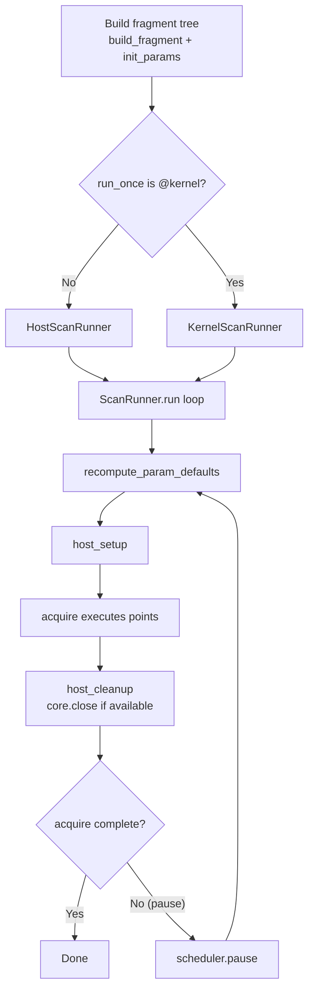
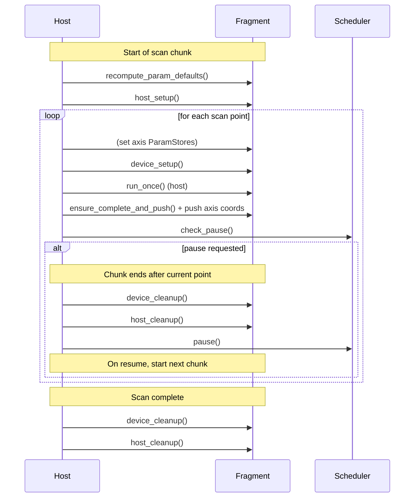
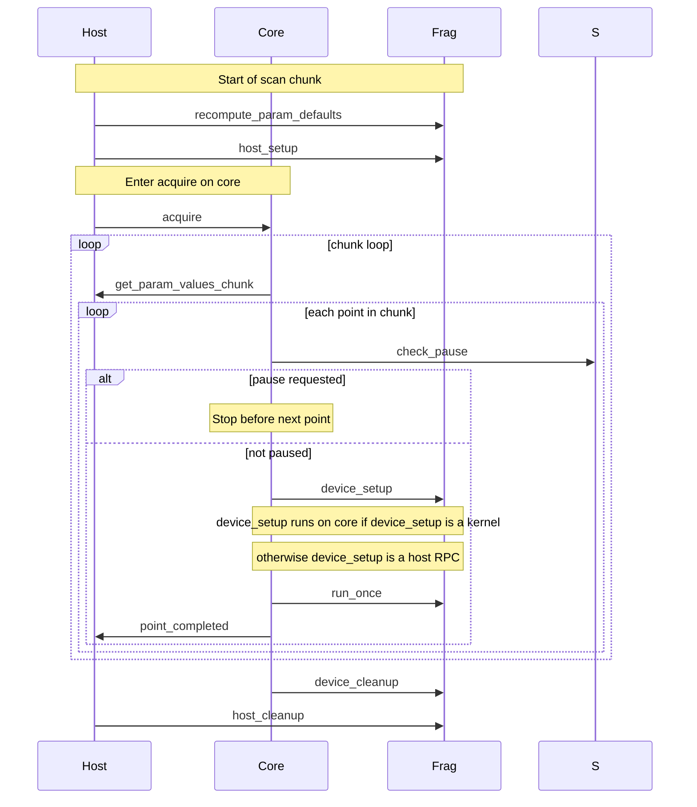
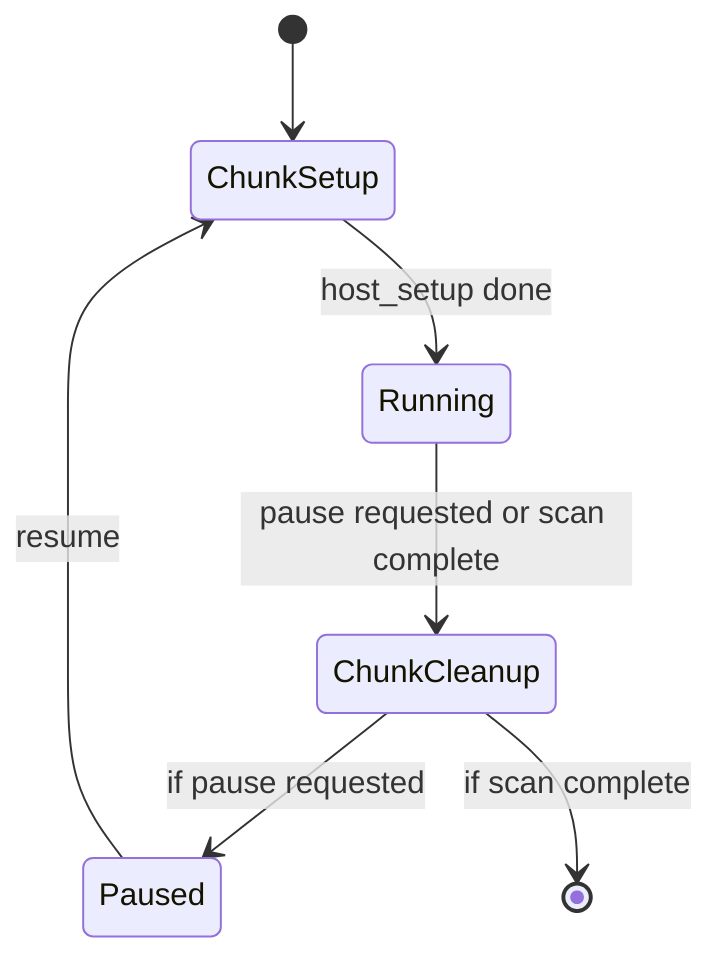

## NDScan Subscan Flattening Project (Active Notes)

This file now has two parts:

1. active plan + decisions (top section, kept concise)
2. historical notes and experiments (original content below)

### Goal

Support ragged subscans and incremental visibility while moving from
list-of-lists toward a flattened schema that is append-only and segment-indexed.

### Why

- Current subscan data is pushed as full lists only at end-of-subscan.
- Ragged subscan lengths are awkward in legacy dataset layout.
- Live in-progress visibility for long subscans is desired.

### Decisions Locked So Far

- Work should be atomic and commit-by-commit with tests after each step.
- Keep legacy output intact while introducing new paths (parallel rollout).
- Use deterministic IDs for new preview/flat channels (avoid sanitized-name keys).
- Keep preview (`subscan_preview`) and persistent flat storage (`subscan_flat`)
  logically separate during rollout.

### Commit Sequence (Working Plan)

1. Baseline characterization tests (done):
   - bulk push is once per subscan for aggregate channels
   - ragged storage currently list-of-lists
   - slash-to-underscore collision risk captured
2. Sink primitives:
   - add `TeeSink`
   - add resettable dataset sink semantics
3. Live preview wiring:
   - tee child per-point sinks, not aggregate list-at-end sinks
   - emit preview metadata root and point stream
4. Flattened persistent schema in parallel:
   - append-only `points.*`
   - segment metadata: `segments.start` and `segments.len`
5. Reconstruction helpers + consumer migration path.

### Known Pitfalls to Keep in Mind

- Name-path flattening (`"/" -> "_"`) can collide.
- `SubscanExpFragment` currently contributes underscore-heavy names (`"_"` prefix).
- `SingleUseSink` constraints mean each channel can only be pushed once per point.
- `AppendingDatasetSink` asserts on `None` values.

### Delimiter Semantics and Naming Policy

- `.` is the ARTIQ dataset namespace separator.
- `/` is ndscan path structure.
- `_` is a regular character in human names.

Therefore sanitizing path delimiters into underscores is lossy and collision-prone.
For new roots (`subscan_preview`, `subscan_flat`), prefer deterministic machine IDs
for dataset keys and keep human-readable names in metadata. If readability in key
names is needed, use `<slug>__<short_id>` rather than slug-only names.

Current implementation direction:
- subscan roots use `human_slug__stablehash`
- flat segment metadata includes:
  - `starts` (flat offset per completed subscan invocation)
  - `outer_index` (invocation index to align with outer/top-level point order)

### Future Scan Topology Requirements (Recorded)

- Scan points should not assume a rectilinear grid.
- Handle subsets may be scanned in tandem as aligned per-point tuples, e.g.:
  - `handle_a: [3, 5, 2, 4]`
  - `handle_b: [4, 8, 2, 3]`
  - `results:  [g, j, c, e]`
- Dynamic subscans may produce variable-length traces for some handles, e.g.:
  - `handle_c` defines outer points
  - `handle_d` trace length varies by outer point
  - flattened storage should remain append-only
  - segment starts (`starts`) delineate per-outer-point subscan spans
- This means flattened schemas should optimize for:
  - append-only point/result arrays
  - lightweight segment indexing (no rigid grid assumptions)
  - reconstruction by slicing spans, not by N-D reshaping.

### Test Commands (Host-side)

From repository root:

```bash
PYTHONPATH=test:. /home/lab/artiq-files/install/virtualenvs/artiq-nix-dev/bin/python -m unittest -q test_experiment_subscan test_utils
```

Full unittest discovery:

```bash
PYTHONPATH=test:. /home/lab/artiq-files/install/virtualenvs/artiq-nix-dev/bin/python -m unittest discover -s test -p "test_*.py" -v
```

---

## Historical Notes (Archive)

This file lists the changes I wish to make to NDScan.

Currently ndscan does not support 'ragged' scans (see examples below) where the number of points per subscan can vary. This is problematic for implementing:
- Schemes where points are repeatedly run until a condition is met (i.e. an error threshold is reached)
- Machine learning style optimisations where multiple parameters are scanned in tandem with a gradient descent optimiser, or a gaussian process learner optimiser.

Currently, the datasets are stored as lists-of-lists. The artiq datasets actually prefer lists with append only style or wipe the slate clean style writes. So why not follow this?

This is in order to fix https://github.com/OxfordIonTrapGroup/ndscan/issues/388 . Where I wish the subscans to not have all their data shoved into the dataset in one bulk go, but incrementally. It would be worthwile having some 'depth' or 'append frequency' so fast running experiments at the bottom don't spam RPC calls.

This fix would allow me to eventually go onto modify the applets to show the subscan data as it comes in. I plan to do this in a golden ratio style sub plots in a sprial, as in some window managers. This doesn't need to be done just yet.

It would also allow me to make a scan runner mode that grabs the handles of certain parameters and can control them in parallel in an machine learn-y type method.

It states:

>     Subscans, including on-kernel subscans, sometimes take a long time to run (e.g. many minutes). Currently, however, the results are only pushed to datasets and available in the applets once the entire subscan has completed, i.e. a complete point of whatever top-level scan has been completed.
> 
>     It would be nice to see the data incrementally as it comes in (to spot issues early when debugging code/system issues, and for the impatient experimentalist in general).
> 
>     This shouldn't require much more than just writing out the subscan data to a configurable AppendingDatasetSink in addition to the ArraySink currently employed, and emitting metadata like in TopLevelRunner._broadcast_metadata. We'll also need to make sure that the applet in fact handles complete rewrites of al the scan information correctly (#387) as the subscan proceeds from point to point.
> 
>     @JammyL This is part 1 of the RBM live analysis discussion we had on 2023-05-05 (part 2 being the option to execute online analyses master-side).
> 
>     In this context, we had discussed an alternative option where result channels could take "preview"/... values, such that the entire subscan result can be updated multiple times.
> 
>     However, first of all, we'd need to make sure we can efficiently modify say the result array for a subscan of a subscan without rewriting the entire array every time. This should be possible with sipyco.sync_struct (there are "Mod"s for modifying array indices), but is probably a largely untested code path.
> 
>     Also, what would happen if the experiment is interrupted? We need to make sure never to end up with jagged arrays, as this would mean that the dataset is not saved to HDF5 at all, yet interrupted subscans would naturally lead to an "unfinished row" in the subscan result channels. This could be worked around by having a "cleanup routine" that chucks away the incomplete data, but seems annoying.
> 
> 
> 
>         Also, what would happen if the experiment is interrupted? We need to make sure never to end up with jagged arrays, as this would mean that the dataset is not saved to HDF5 at all
> 
>     In the current implementation this isn't an issue because the data is only posted to a dataset at the end of each point (subscan)? For subscans the array is of a known fixed length. When working with the 2D plot colorbars (#329), padding points with np.nan worked very seamlessly. Perhaps a similar approach would work here, but in the datasets.
> 
>     For the avoidance of doubt, these are my notes from the ABaQuS lab book back then, mostly 1:1. I still think the "in-progress subscan off to the side in a separate applet" is probably in the sweet spot of not complicating the design while providing the desired functionality.
> 
> 
>     I am certainly in the category of 'impatient experimentalist' given out 1Hz rep rate - so I'm keen to get this working.
> 
>     Before I try get into this issue, has there been any progress I should be aware of since last year? And any pointers you may give me before diving in (I've not dove into the guts of ndscan and artiq yet)?
> 
>     Hi @tomhepz, thanks for checking in – no progress unfortunately, but I am still happy with the basic design outlined above (an explict in-progress ndscan "root" where the subscan is exposed as if it was a top-level scan, overwritten at every point new of the top-level scan).
> 
>     As to pointers, please feel free to comment/ask for clarification/… here as you go along. You won't need too much knowledge of the "guts" of ARTIQ beyond basics about datasets, etc., but will need to have a look at the ndscan parts mentioned in the first post (the fact that TopLevelRunner._broadcast_metadata creates the structure for the applet to be able to display the plot, etc.).
> 
>     Hi @dnadlinger , thanks for this - I have thought about this more, and I think a path toward a nice solution is to have a Sink that itself has an AppendingDatasetSink and also an ArraySink perhaps with some reset logic for the Dataset.
> 
>     class TeeSink:
>         def __init__(self, primary, secondary):
>             self._a = primary      # ArraySink
>             self._b = secondary    # AppendingDatasetSink with subscan key
>         def push(self, value):
>             self._a.push(value)
>             self._b.push(value)
> 
>         def get_all(self):
>             return self._a.get_all()
>         def get_last(self):
>             return self._a.get_last()
> 
>         def clear(self):
>             # Reset dataset here?
>             return self._a.clear()
> 
>     However I have been thinking more generally - given the preference for Artiq to have non-ragged arrays, and liking appending onto the end of datasets, is there a case to be made for a flattened schema?
> 
>     i.e.
>     top level axis: [a,b,c]
>     sub scan axis: [[1,2,3],[1,2,3],[1,2,3]]
> 
>     not turning into something like
>     i.e.
>     top level axis: [a,b,c]
>     sub scan axis: [1,2,3,1,2,3,1,2,3]
>     cut metadata (start index): [0,3,6]
> 
>     similarly with the results data.
> 
>     Benefits of this with regard to this specific issue is that everything can be an AppendingDatasetSink, with nice types. And perhaps we can do something cleverer where we can have a batch update size if the bottom level updates are very frequent and need not spam async to the dashboard.
> 
>     Another benefit of this scheme is that adaptive scanning generator that would, for example, produce different numbers of subscan axis points would not make a ragged array. In my testing I have been trying to implement schemes like:
> 
>         Sit on a point scanning a dummy index until the binomial error bar is less than a threshold
>         Make the next point have parameters predicted to maximally constrain the model and stop when an error budget is reached
>         Scan over a large parameter space with machine learning bayesian optimisation to optimise a black box function
> 
>     As far as I can see the above flattened principle would in principle make the live plotting, storage, and analysis (after a helper function is written) easier.
> 
>     Keen to hear your architectural thoughts on this - I've likely missed something or been extremely naive so I apologize in advance if so!

On achieving this, places to look in the code:
We probably want to implement some kind of `RepeatUntilGenerator`.
The 


```
# Minimal ragged subscan demo (host-only, no core device needed)
# Drop this file somewhere your ARTIQ/ndscan experiment explorer can see it.

from ndscan.experiment import (
    ExpFragment,
    SubscanExpFragment,
    FloatParam,
    IntParam,
    ListGenerator,
    make_fragment_scan_exp,
    LinearGenerator,
    ScanOptions,
    CustomAnalysis,
    FloatChannel,
    annotations,
    OpaqueChannel,
)

import numpy as np
from scipy.optimize import curve_fit


class LineExp(ExpFragment):
    def build_fragment(self):
        self.setattr_param("p", FloatParam, "p", default=2.0)
        self.setattr_param("x", FloatParam, "x", default=0.0)
        self.setattr_result("y")  # Float channel by default

    def run_once(self):
        x = self.x.use()
        m = self.p.use() ** 2  # This is the unknown functional form of how m varies
        self.y.push(m * x)  # simple deterministic number

    def get_default_analyses(self):
        return [
            CustomAnalysis(
                [self.x],
                self._analyse_grad,
                [
                    OpaqueChannel("fit_xs"),
                    OpaqueChannel("fit_ys"),
                    FloatChannel("m", "extracted m"),
                ],
            )
        ]

    def _analyse_grad(self, axis_values, result_values, analysis_results):
        x = axis_values[self.x]
        y = result_values[self.y]

        def model(x, m):
            return m * x

        popt, pcov = curve_fit(model, x, y)
        m = popt[0]

        fit_xs = np.linspace(np.min(x), np.max(x), 20)
        fit_ys = m * fit_xs

        analysis_results["fit_xs"].push(fit_xs)
        analysis_results["fit_ys"].push(fit_ys)
        analysis_results["m"].push(m)

        return [
            annotations.curve_1d(
                x_axis=self.x, x_values=fit_xs, y_axis=self.y, y_values=fit_ys
            )
        ]


class ScanXExpFrag(SubscanExpFragment):
    def build_fragment(self):
        self.setattr_fragment("lineexp", LineExp)
        super().build_fragment(self, "lineexp", [(self.lineexp, "x")])

    def _configure(self): # THIS IS UNRAGGED
        n = 6
        gen = LinearGenerator(0.0, 5.0, n, False)
        opts = ScanOptions(
            num_repeats=1, num_repeats_per_point=1, randomise_order_globally=False
        )
        self.configure([(self.lineexp.x, gen)], options=opts)

    def host_setup(self):
        self._configure()
        super().host_setup()

    def device_setup(self):
        self._configure()
        self.device_setup_subfragments()


class HowDoesPVaryExpFrag(SubscanExpFragment):
    def build_fragment(self):
        self.setattr_fragment("scanxexp", ScanXExpFrag)
        super().build_fragment(self, "scanxexp", [(self.scanxexp.lineexp, "p")])

    def _configure(self):
        gen = LinearGenerator(0.0, 5.0, 10, False)
        opts = ScanOptions(
            num_repeats=1, num_repeats_per_point=1, randomise_order_globally=False
        )
        self.configure([(self.scanxexp.lineexp.p, gen)], options=opts)

    def host_setup(self):
        self._configure()
        super().host_setup()

    def device_setup(self):
        self._configure()
        self.device_setup_subfragments()


UNRaggedHowDoesPVaryExp = make_fragment_scan_exp(HowDoesPVaryExpFrag)
```

# 


```
# Minimal ragged subscan demo (host-only, no core device needed)
# Drop this file somewhere your ARTIQ/ndscan experiment explorer can see it.

from ndscan.experiment import (
    ExpFragment,
    SubscanExpFragment,
    FloatParam,
    IntParam,
    ListGenerator,
    make_fragment_scan_exp,
    LinearGenerator,
    ScanOptions,
    CustomAnalysis,
    FloatChannel,
    annotations,
    OpaqueChannel,
)

import numpy as np
from scipy.optimize import curve_fit


class LineExp(ExpFragment):
    def build_fragment(self):
        self.setattr_param("p", FloatParam, "p", default=2.0)
        self.setattr_param("x", FloatParam, "x", default=0.0)
        self.setattr_result("y")  # Float channel by default

    def run_once(self):
        x = self.x.use()
        m = self.p.use() ** 2  # This is the unknown functional form of how m varies
        self.y.push(m * x)  # simple deterministic number

    def get_default_analyses(self):
        return [
            CustomAnalysis(
                [self.x],
                self._analyse_grad,
                [
                    OpaqueChannel("fit_xs"),
                    OpaqueChannel("fit_ys"),
                    FloatChannel("m", "extracted m"),
                ],
            )
        ]

    def _analyse_grad(self, axis_values, result_values, analysis_results):
        x = axis_values[self.x]
        y = result_values[self.y]

        def model(x, m):
            return m * x

        popt, pcov = curve_fit(model, x, y)
        m = popt[0]

        fit_xs = np.linspace(np.min(x), np.max(x), 20)
        fit_ys = m * fit_xs

        analysis_results["fit_xs"].push(fit_xs)
        analysis_results["fit_ys"].push(fit_ys)
        analysis_results["m"].push(m)

        return [
            annotations.curve_1d(
                x_axis=self.x, x_values=fit_xs, y_axis=self.y, y_values=fit_ys
            )
        ]


class ScanXExpFrag(SubscanExpFragment):
    def build_fragment(self):
        self.setattr_fragment("lineexp", LineExp)
        super().build_fragment(self, "lineexp", [(self.lineexp, "x")])

    def _configure(self): # THIS IS RAGGED
        p_now = self.lineexp.p.use()
        n = 2 + (int(p_now) % 3) * 2
        gen = LinearGenerator(0.0, 5.0, n, False)
        opts = ScanOptions(
            num_repeats=1, num_repeats_per_point=1, randomise_order_globally=False
        )
        self.configure([(self.lineexp.x, gen)], options=opts)

    def host_setup(self):
        self._configure()
        super().host_setup()

    def device_setup(self):
        self._configure()
        self.device_setup_subfragments()


class HowDoesPVaryExpFrag(SubscanExpFragment):
    def build_fragment(self):
        self.setattr_fragment("scanxexp", ScanXExpFrag)
        super().build_fragment(self, "scanxexp", [(self.scanxexp.lineexp, "p")])

    def _configure(self):
        gen = LinearGenerator(0.0, 5.0, 10, False)
        opts = ScanOptions(
            num_repeats=1, num_repeats_per_point=1, randomise_order_globally=False
        )
        self.configure([(self.scanxexp.lineexp.p, gen)], options=opts)

    def host_setup(self):
        self._configure()
        super().host_setup()

    def device_setup(self):
        self._configure()
        self.device_setup_subfragments()


RaggedHowDoesPVaryExp = make_fragment_scan_exp(HowDoesPVaryExpFrag)

```

For some more ndscan/artiq context, here are some of my notes:

# Making a sequence note

For simple sequences, can just use vanilla Artiq's `EnvExperiment`. But for making parts that will be reused
within the experiment in multiple places, it's best to make it an `ndscan` `ExpFragment` to make it composible.

I haven't looked yet but I assume that the best place to make debugging experiments is with the interactive args.

- Use the `constants.py` file for defaults, try make the datastructures nice so they can be reused.
- Use the datasets feature of artiq to store live servo params (i.e. if we have regular calibration scans).
These can be loaded in as NDScan defaults.
- On every timeline stamp in a fragment, add a note on what is expected to be initialised, and whether things can be done more than once in a sequence.

Stuff that can't be scanned should go in host_setup, can can happily use dictionaries, but stuff that can be scanned should end up in a list in the kernel, and should be updated in the kernel. 

It should go in device_setup() if it's latency sensitive between steps, or in the fragment kernels the user runs if this latency penaltiy mid sequience isn't a problem. i.e. in the sequence you might want to do a then b quickly after.

If I'm scanning a parameter in b that takes a while to setup it's better to do setupb->a->b rather than a->setup_b->b . Also, it would be good to make use of the changed_after_use that would allow you to not resetup hardware that could be expensive to setup if it's not being scanned (static). I imagine this requires one to write lists of parameters that if any one of them (logical ORd) are changed_after_use then do the setup. For edxample, we might have a list of paramhandles that are for the RAM parameters, and in that case you would redo the RAM upload if any of them had changed. I prefer the kernel scan runner if possible.


# NDScan flow

This file elucidates various flows of data within the ndscan framework.

A generic Artiq experiment looks like:
```python
from artiq.experiment import *     

class SetLED(EnvExperiment):

    def prepare(self):
        # Precompute something 'intensive' on the timescale of exp
        pass
    
    def build(self):
        self.setattr_device("core")
        self.setattr_device("led1")
        self.setattr_argument("state", BooleanValue(True))

    @kernel
    def run(self):  
        self.core.reset()
        self.led1.set_o(self.state) # Connected to L1 on front panel of Kasli SOC
```
An `EnvExperiment` is one which is both an `Experiment`, and `HasEnvironment`.
An `Experiment` says you must create `prepare()`, `run()`, `analyse()` methods.
`HasEnvironment` says you are in an Artiq context, and therefore have access to
various concepts, e.g. (arguments, devices, datasets). One of the functions you
must then implement is `build()`, which typically sets device driver handles as kernel
invariants, and requests arguments.

There are some problems with this regarding composability. It encourages a big god object sat inside run, and is hard to compose and maintain sequences.
The `ndscan` library aims to solve this.

To convert from a default artiq `EnvExperiment` to an ndscan `Fragment` (or `ExpFragment` if it makes sense to run in isolation). You want to: turn `build` into a `build_fragment`; consider adding `host_setup`, `device_setup` and their equivelent teardown methods; and turn `run` -> `run_once` if you want it to be an `ExpFragment`. Ideally fold the contents of `prepare` into `host_setup` unless there's good performance reasons not to.


> [!WARNING]  
> The below mermaid diagrams were generated with generative AI, they may be incorrect.

## Runner selection + high-level scan-chunk loop (flowchart)


## HostScanRunner: per-point order + pause boundary (sequence)


## KernelScanRunner: chunking + pause polling (sequence)



## A tiny state diagram for “why did setup run again?”


